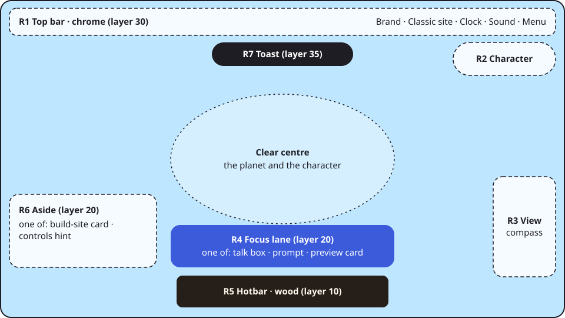
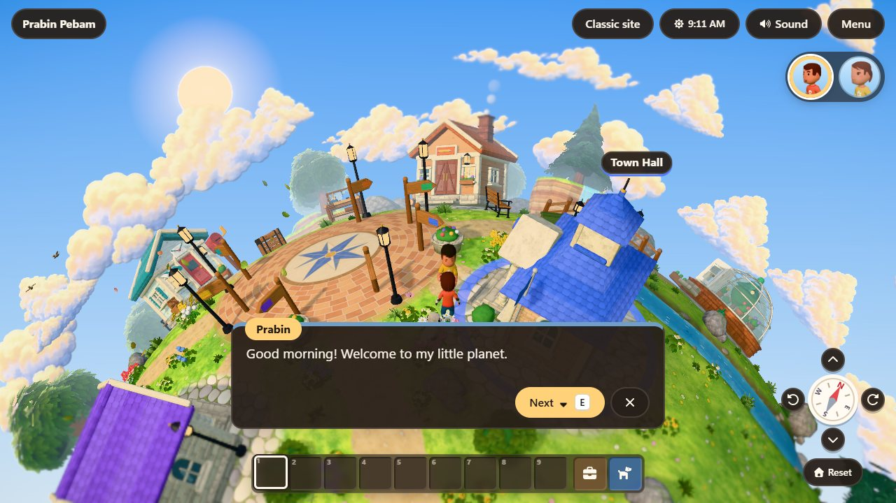

# Game UI design system

> **TL;DR.** The rules for every piece of UI on the site and in the game. All values come from **tokens** (one DTCG file, three tiers, generated CSS). Components read colour only through **surface roles**: **Wood** (dark) is the game, **Paper** (light) is the website. The screen is split into fixed **regions** with the centre kept clear. A pure **arbiter** (`ui/lanes.ts`) decides the one thing that may ask for attention, and it decides what <kbd>E</kbd> does as well. Copy is warm, plain and short. Tests enforce all of this (`tests/unit/designSystem.test.ts`, `tests/unit/lanes.test.ts`). The research and the critique behind these rules are in [the spec](spec.md). The token list is in [tokens.md](tokens.md).

## 1. Principles

These are ranked: when two conflict, the higher one wins.

| # | Principle | What it means in practice |
|---|---|---|
| P1 | **The planet first** | The centre of the screen belongs to the world. The HUD lives on the edges, is small, and hides when there's nothing to say. |
| P2 | **One thing asks at a time** | At most one surface asks for attention in the focus lane, and <kbd>E</kbd> always does what that surface says. There's never a second "press E". |
| P3 | **The prompt tells the truth** | The prompt names the verb and the object that <kbd>E</kbd> will act on right now. If <kbd>E</kbd> would do something else, the prompt is wrong. |
| P4 | **One meaning per surface** | Wood means "you're in the game"; Paper means "you're on the website". Never mix them within one region. |
| P5 | **Tokens, not values** | A colour, size, space, radius, shadow, duration or layer that isn't a token is a bug. Add a token first. |
| P6 | **Calm motion** | Motion explains a change (appear, move, confirm); it never decorates. It's short, eased, and removed under reduced motion. |
| P7 | **Every cue has a text twin** | Anything shown by colour, motion, sound or a 3D cue (a wiggling chest) is also said in words: a prompt, a label, or a live-region announcement. |
| P8 | **The classic site is one step away** | From any state, one visible control leads to the plain-HTML content. |
| P9 | **Warm, plain words** | Talk like a friendly guide: short sentences, everyday words, no jargon, no blame (§7). |

## 2. The framework for deciding

When something new wants to be on screen, answer these in order:

1. **Is it needed now?** If the player can't act on it or it doesn't change what they'll do next, it's a toast at most, or nothing.
2. **Who owns input?** It follows the input-owner order (§6.2). A new surface that takes keys is a modal or a panel, never a HUD element.
3. **Which region?** Pick one from §5. If none fits, it doesn't go on screen: talk to the owner.
4. **Which rank?** In the focus lane or the aside, give it a rank in `lanes.ts` and a unit test. Never make two things visible by giving one a higher z-index.
5. **Which components and tokens?** Reuse a component from §4; add component tokens (`c.*`) only when it needs values the semantic tier doesn't have.
6. **What does it say?** Write the copy with §7, and add the live-region announcement (P7).

## 3. Tokens

The source of truth is `src/design/tokens.json`, in the [W3C Design Tokens (DTCG 2025.10)](https://www.designtokens.org/tr/drafts/format/) format. `node scripts/build-tokens.mjs` generates `src/styles/tokens.css` and [tokens.md](tokens.md). Never hand-edit either; the unit test fails if they're out of date (`--check`).

| Tier | Prefix | Who may use it | Examples |
|---|---|---|---|
| 1. Primitives | `--p-*` | Only other tokens. Never component CSS (the lint rejects it) | `--p-color-wood-900`, `--p-color-gold-300` |
| 2. Semantic | `--color-*`, `--space-*`, `--radius-*`, `--border-*`, `--font-*`, `--text-*`, `--weight-*`, `--leading-*`, `--tracking-*`, `--shadow-*`, `--dur-*`, `--ease-*`, `--layer-*` | All CSS | `--space-4`, `--text-sm`, `--layer-lane` |
| 3. Component | `--c-*` | The component they belong to | `--c-btn-h`, `--c-lane-edge`, `--c-view-size` |

**Surfaces.** A surface class maps the `--surface-*` roles (`bg`, `bg-soft`, `bg-warm`, `bg-sunk`, `bg-glass`, `text`, `text-muted`, `line`, `border`, `accent`, `accent-hover`, `on-accent`, `link`, `focus`, `highlight`, `highlight-soft`, `positive`, `negative`) to one colour set:

| Surface | Where | Look |
|---|---|---|
| `.surface-wood` | `body.play` (the whole game), the backpack, crafting, paint and the dialogs on it | Dark wood-brown, cream text, **gold** primary actions with dark text, light-blue links. Key caps stay light so they read as keys. `color-scheme: dark`. |
| `.surface-paper` (the default, on `:root`) | The landing and classic pages | Warm off-white, ink text, blue primary actions and links. |

Both surfaces define every role (a test checks), and each surface re-declares `color`, because inherited text colour doesn't follow a changed custom property.

**Scales.** Space is a 4 px grid (`--space-0-5` … `--space-18`). Type is `--text-2xs` (0.625 rem) to `--text-hero`; everything is in `rem`, so the "Larger text" setting (`html.text-lg`, 112.5 %) scales it all. Layers are named, not numbered: `base` 1 < `hud` 10 < `lane` 20 < `fade` 25 < `chrome` 30 < `toast` 35 < `overlay` 40 < `drag` 45 < `skip` 1000.

## 4. Components

Each component has one class family, reads only surface roles and tokens, and has its own section in one stylesheet.

| Component | Class | Stylesheet | Anatomy and variants |
|---|---|---|---|
| Button | `.btn` | `components.css` | Label (verb first), optional icon (`Icon`, `aria-hidden`), optional `.kbd`. Variants: default (soft surface), `.primary` (the accent; one per view), `.sm`, `.big`, `.icon-btn` (icon only, with an `aria-label`). Height `--c-btn-h`, 44 px minimum target. |
| Key cap | `.kbd` | `components.css` | A light cap with dark text on both surfaces. It shows a key; it's never the only label. |
| Card | `.card`, `.card-title` | `components.css` | The surface's `bg`, `--radius-lg`, `--shadow-card`. An optional eyebrow, a title, a body and `.actions`. Landmark cards carry `--accent` as a top rule. |
| Dialog | `.dialog`, `.landmark-dialog`, `.menu-dialog` | `components.css` | Native `<dialog>` (focus is trapped and restored, Esc closes). Title, body, actions with the primary action first. |
| Menu list, check, radio group | `.menu-list`, `.menu-item`, `.check`, `.radio-group` | `components.css` | Settings rows in the menu (sound, time, larger text). |
| Time badge | `.time-badge` | `components.css` | The clock chip in the top bar; `.time-scrubbing` while dragging. |
| Top bar | `.play-header`, `.brand`, `.hud-actions` | `hud.css` | Brand (the site's home), Classic site, time, sound and menu. It never wraps (the brand shortens on narrow screens). |
| Focus lane | `.lane` | `hud.css` | The bottom-centre slot above the hotbar. It holds one of: talk box, stand-up prompt, action prompt, preview card. |
| Action prompt | `.seat-prompt.action-prompt` | `hud.css` | Icon + verb + object + `.kbd`. It's a real button (a click or tap does the same as <kbd>E</kbd>). |
| Preview card | `.preview-card` | `hud.css` | The landmark's eyebrow, title and one line, with Enter to open. |
| Talk box | `.talk-box` | `hud.css` | Name, the line (typed; instant under reduced motion), "more" cue, Next/Close actions. |
| Aside | `.aside` (`.hint`, `.site-card`) | `hud.css` | Bottom left: the site card (a build goal's needs) or the controls hint. |
| Toast | `.toast` | `hud.css` | Top centre, one at a time, announced; 4 to 9 s by length. |
| View controls | `.view-controls`, `.view-btn`, `.compass` | `hud.css` | Tilt, rotate, compass and Reset, bottom right. |
| Character picker | `.character-picker`, `.avatar-btn` | `hud.css` | A radio group of portraits, top right. |
| Hotbar and slot | `.hotbar`, `.slot`, `.slot-key`, `.slot-count` | `panels.css` | Nine slots, the backpack and the whistle. The selected slot uses `--surface-highlight`. |
| Backpack, crafting, paint | `.inv-panel`, `.craft-panel`, `.paint-panel` | `panels.css` | Wood panels on the overlay layer: head, sections, help line with keys. |

Adding a component: give it a class family, put it in the right stylesheet, use only surface roles and tokens (add `c.*` tokens if needed), add its row here, and let the design-system test run.

## 5. Screen regions

| Region | Where | Holds | Rule |
|---|---|---|---|
| R1 Top bar | Top edge | Brand, Classic site, time, sound, menu | Always visible in play (P8). |
| R2 Character picker | Top right, below R1 | Portraits | |
| R3 View controls | Bottom right | Tilt, rotate, compass, Reset | |
| R4 **Focus lane** | Bottom centre, above the hotbar | One of talk, stand, prompt, preview | Decided by `focusLane` (§6.3). |
| R5 Hotbar | Bottom centre edge | Slots, backpack, whistle | |
| R6 Aside | Bottom left | Site card or controls hint | Decided by `asideLane` (§6.4). |
| R7 Toast | Top centre, below R1 | One toast | Never in the lane. |
| Centre | The middle of the screen | The world | Nothing but world-anchored labels (landmark names) and the fade. |
| Overlay | Full screen | Dialogs and wood panels | Takes the keys; R4 and R6 stay empty. |

On narrow screens (`COMPACT_QUERY`, ≤ 760 px) the aside stacks above the lane, so the aside gives way whenever the lane has something.

## 6. Priority

### 6.1 The layer stack

Use `--layer-*` only; a raw z-index fails the lint. From bottom to top: `base` (the canvas), `hud` (the chrome's regions), `lane`, `fade` (travel), `chrome` (the top bar stays above the fade), `toast`, `overlay` (dialogs, panels), `drag` (an item on the cursor), `skip` (the skip link). World-anchored labels (drei `Html`) are capped below the HUD with `zIndexRange [9, 0]`.

### 6.2 Who owns input

The first match owns the keys: **modal** (landmark dialog, menu, Chopper's card) > **panel** (backpack, crafting, paint) > **conversation** (the talk box) > **seated** (on a bench or a chair) > **world** (walking, targets). Keys only act while the game region has focus, and Tab is never intercepted (WCAG 2.1.4).

### 6.3 The focus lane

`focusLane(state)` in `src/game/ui/lanes.ts` returns one of the following:

1. `talk`: a conversation is open;
2. `stand`: seated, so the prompt is "Stand up";
3. nothing while an action is playing out (chopping, mining);
4. `prompt`: there's a target;
5. `preview`: a landmark is near;
6. nothing.

It returns nothing before play, while travelling, and under any overlay. Under an overlay, `laneBeneath` says what the lane *would* hold, and the HUD keeps that surface mounted but `hidden`, so the button that opened a dialog is still there to take the focus back when it closes. The HUD renders only the winner, and `controller.interact()` (<kbd>E</kbd>) acts on the same winner, so what's on screen and what <kbd>E</kbd> does can't disagree (P2, P3).

### 6.4 The aside

`asideLane(state, compact)` puts context before help: the site card (a build goal is near), then the controls hint. It shows nothing during a conversation, and on compact screens nothing while the lane is busy.

### 6.5 Target tiers

When several things are in reach, `pickTarget` (`systems/interactables.ts`) adds a tier penalty (`TIER_U`) to the distance score:

| Tier | Kinds | Penalty |
|---|---|---|
| 0: people and purposeful objects | NPC, chest, crafting table, build site, bench | 0 |
| 1: things to gather | Tree, boulder, flower | 0.1 u |
| 2: the companion | Chopper | 0.45 u |

So Chopper, who follows you everywhere, never takes the prompt from the person you walked up to.

### 6.6 Toasts and the talk guard

- **One toast at a time; the newest replaces the last.** It stays `toastMs(text)` (4 to 9 s by length, WCAG 2.2.1), is announced in the live region, and never sits in the lane.
- **The talk guard.** The first <kbd>E</kbd> within `TALK_GUARD_MS` (0.3 s) of a conversation opening is ignored (a post-acceptance delay, per the Game Accessibility Guidelines), so a double press can't skip a line unread.

## 7. Copy

**Voice:** a friendly local guide. Warm, plain, brief, never cute at the expense of clarity. Chopper's lines may be playful; system messages are never jokes.

| Rule | Do | Don't |
|---|---|---|
| Sentence case everywhere | "Open chest" | "Open Chest" |
| Labels start with a verb, 3 words at most | "Classic page", "Craft", "Stand up" | "Click here", "OK", "Submit" |
| A prompt is verb + object, about 20 characters | "Talk to Prabin", "Chop tree" | "Press E to interact with the tree" |
| An error says what happened and how to fix it | "Not enough materials for Planks now. Check your backpack." | "Error: insufficient resources" |
| Name things the same way every time | the glossary below | synonyms |
| Contractions and "you" | "Couldn't find that place, so you're at the plaza." | "The requested location was not found." |
| No emoji or text symbols as icons | a Font Awesome icon plus a label | ☀ ▲ ↗ |
| Keys are shown as key caps, and never the only label | "Open chest <kbd>E</kbd>" | "<kbd>E</kbd>" alone |

**Glossary:** *planet* (the 3D world), *classic site* (the plain pages; *classic page* for one landmark's page), *backpack* (the inventory), *chest* (storage), *crafting table*, *hotbar*, *menu*, *the plaza* (lowercase, it's a place, not a title), *Chopper's house*.

The copy lint in the design-system test rejects emoji, "click here", "OK", "Submit", "Open full page" and "the Plaza".

## 8. Accessibility

- **Contrast:** the unit test checks every text role on every background of both surfaces, over the sky or the world behind translucent ones, plus the accent buttons, the toast and the talk plate at 4.5:1 (WCAG 1.4.3), and focus rings and borders at 3:1 (WCAG 1.4.11).
- **Targets:** at least 44 × 44 px (`--c-btn-h`, the view buttons, slots).
- **Text:** functional text is at least 14 px (`--text-sm`); the smaller sizes are only for eyebrows and counts. "Larger text" in the menu scales everything by 112.5 % and is saved (`site.largeText`).
- **Focus:** a visible ring in the surface's `--surface-focus`; dialogs trap focus and give it back.
- **Motion:** every animation uses `--dur-*` and `--ease-*`, and `prefers-reduced-motion` shortens it to nothing (the talk box then shows lines instantly).
- **Text twins (P7):** prompts are buttons with names; toasts, talk lines and results are announced in the polite live region.
- **Keys:** scoped to the focused game region; Tab and the browser's keys are never taken.

## 9. Governance

- `tests/unit/designSystem.test.ts` checks:
  - generated tokens are up to date, and every `var()` is defined;
  - no colour literals and no `--p-*` in component CSS;
  - z-index only from layers; font sizes only from `--text-*` or `em`; weight and leading from their scales; radius from the scale;
  - durations and easing from motion tokens, and no px/rem spacing literals;
  - only three free custom properties (`--slot`, `--hotbar-h`, `--lane-bottom`);
  - inline styles have no colour literals;
  - contrast on both surfaces, and wood defines every paper role;
  - the copy lint.
- `tests/unit/lanes.test.ts` covers the arbiter, the aside, the compact rule, toast timing, the guard and the target tiers.
- The E2E test "one thing asks at a time" talks to Prabin by a landmark, checks that only the talk box shows, and checks that <kbd>E</kbd> advances it.
- **To add a token:**
  1. Add it to `tokens.json` with `$type`, `$value` and `$description`, in the right tier.
  2. Run `node scripts/build-tokens.mjs`.
  3. Use the CSS variable.
- **To change a colour:** change the primitive or the role; the contrast test tells you if it still passes on both surfaces.
- **Exceptions:** the lint's exceptions are listed in the test with a reason. Add one only with a reason.
