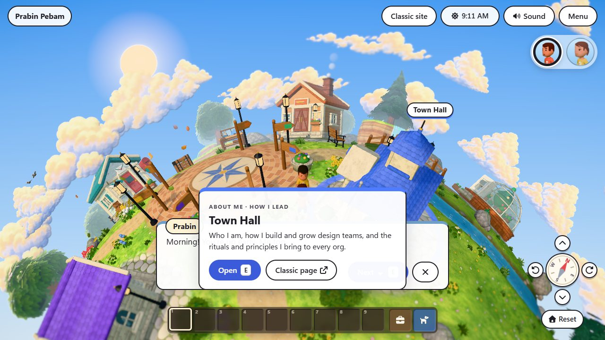
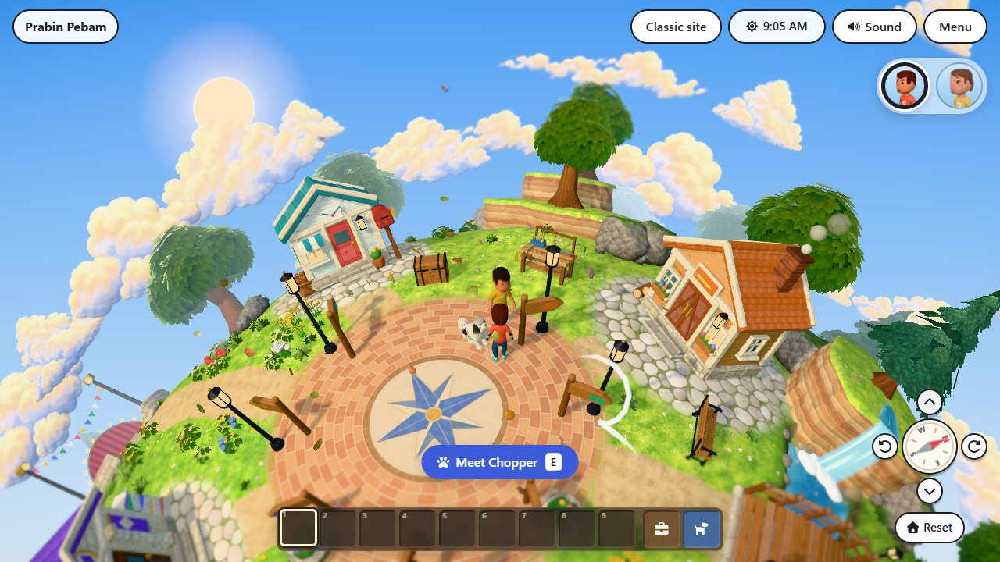
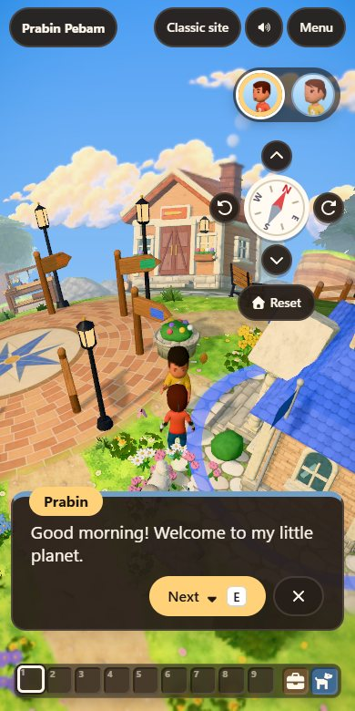

# Game UI and design system: research, audit, spec v1, critique, v2

This is the working spec and plan for the game UI and the design system behind it. The living rules as built are in [the design system](design-system.md), the token reference in [tokens](tokens.md), and the checklist in [the Definition of Done](dod.md).

> **TL;DR.** The HUD had grown one feature at a time: 85 raw colours, 15 z-indexes, 24 font sizes, two visual languages with no rule for which to use, and nothing deciding what may be on screen at once. So the landmark preview card sat over the talk box, and both claimed <kbd>E</kbd>. V2 adds three things. **Tokens** in three tiers, generated from one DTCG file and enforced by tests. **A component catalogue** with two named surfaces, one meaning each: **Wood** (dark) is the game, **Paper** (light) is the website. **A screen-region and priority framework**: one focus lane with a pure arbiter that both the renderer and <kbd>E</kbd> use, target tiers, and the input-owner order. There are also rules for copy, motion and accessibility.

## 1. Research: what the practice says

The sources are cited inline. Anything marked *opinion* is a synthesis with no single source.

**Contextual, minimal HUD.**
- Nintendo's CEDEC 2017 talk on *Breath of the Wild* set the direction "to only display information when necessary, which gives the screen more breathing room". The Pro HUD cut even more, and animation (hearts flashing) kept what remained noticeable ([summary](https://gist.github.com/idbrii/e39fe96279aa1670319bfa521d907399)).
- Fagerholt and Lorentzon's taxonomy ([Beyond the HUD, 2009](https://publications.lib.chalmers.se/records/fulltext/111921.pdf)) sorts UI into four kinds. Mapped onto this game:
  - *Diegetic*: the town-hall clock, the notice board.
  - *Spatial*: the chest and table's ready cues, world labels.
  - *Non-diegetic*: the hotbar, clock badge and compass.
  - *Meta*: the travel fade.
- The [Game Accessibility Guidelines](https://gameaccessibilityguidelines.com/full-list/) (GAG) ask for essential temporary information to stay in the player's eye line, and for an option to hide non-interactive elements.
- Observed conventions, not first-party:
  - Stardew moves its toolbar so it never covers the farmer.
  - Minecraft puts the hotbar bottom centre, action text just above it, and toasts in a corner.
  - ACNH and *A Short Hike* keep almost no persistent HUD.

**One target, one prompt.**
- Unity's XR Interaction Toolkit scores every candidate with a chain of evaluators and picks the best ([target filters](https://docs.unity3d.com/Packages/com.unity.xr.interaction.toolkit@2.2/manual/target-filters.html)): angle to gaze, distance, and a *last selected* term that decays over time (built-in stickiness).
- Unreal's Lyra gathers options from each interactable and triggers the focused one ([interaction system](https://dev.epicgames.com/documentation/en-us/unreal-engine/lyra-sample-game-interaction-system-in-unreal-engine)).
- Genshin lists overlapping pickups beside the centre instead of stacking prompts.
- *Opinion:* score as priority × distance × facing, and give the current target a bonus (hysteresis).

**One owner of input.**
- Unreal CommonUI stacks layers: `Game` < `GameMenu` < `Menu` < `Modal`. Only the focused widget on the top active layer takes input, and deactivating restores the previous input config ([CommonUI notes](https://x157.github.io/UE5/CommonUI/), [input guide](https://dev.epicgames.com/documentation/en-us/unreal-engine/commonui-input-technical-guide-for-unreal-engine)).
- GAG recommends a [0.5 s post-acceptance delay](https://gameaccessibilityguidelines.com/include-a-cool-down-period-post-acceptance-delay-of-0-5-seconds-between-inputs/), so one press can't open and advance a dialog.
- Players should be able to progress through text at their own pace (GAG).
- The speaker must be shown without relying on colour ([XAG 104](https://learn.microsoft.com/en-us/xbox/accessibility/xbox-accessibility-guidelines/104)).

**One notice at a time.**
- Material's snackbar shows one message at a time and queues the rest ([m2 snackbars](https://m2.material.io/components/snackbars)).
- [WCAG 2.2.1](https://www.w3.org/TR/WCAG22/#timing-adjustable) requires that a message not vanish before it can be read.
- [WCAG 4.1.3](https://www.w3.org/TR/WCAG22/#status-messages) requires status messages to be announced.

**Tokens in tiers.**
- The [W3C DTCG format](https://www.designtokens.org/tr/2025.10/format/) (2025.10, stable) defines tokens as `$value` plus `$type`, with `{alias}` references.
- Material 3 uses reference → system → component tokens ([M3 tokens](https://m3.material.io/foundations/design-tokens/overview)).
- In engines, Unity UI Toolkit has [USS variables](https://docs.unity3d.com/6000.0/Documentation/Manual/UIE-USS-CustomProperties.html) and CommonUI has shared style assets.
- No game studio publishes its token system; the tier model is the industry's shared practice.

**Copy.**
- Use sentence case ([Microsoft Writing Style Guide](https://learn.microsoft.com/en-us/style-guide/capitalization), Material).
- Start a label with a verb that names the result ([Apple HIG, buttons](https://developer.apple.com/design/human-interface-guidelines/buttons)).
- Be plain and warm, not clever ([Mailchimp voice and tone](https://styleguide.mailchimp.com/voice-and-tone/)).
- Errors say what happened and how to fix it, without blame ([NN/g](https://www.nngroup.com/articles/error-message-guidelines/)).
- Short strings grow 200–300% in translation ([W3C i18n](https://www.w3.org/International/articles/article-text-size)).

**Accessibility.**
- Text contrast 4.5:1, and 3:1 for large text and UI shapes ([XAG 102](https://learn.microsoft.com/en-us/xbox/accessibility/xbox-accessibility-guidelines/102), WCAG 1.4.3 / 1.4.11).
- Target size: 24 px minimum and 44 px preferred (WCAG 2.5.8 / 2.5.5).
- Single-key shortcuts are fine when they're active only while their component has focus ([WCAG 2.1.4](https://www.w3.org/WAI/WCAG22/Understanding/character-key-shortcuts.html)). The planet's keys already work this way.
- Text should scale, with a large minimum: 18 px body height on PC ([XAG 101](https://learn.microsoft.com/en-us/xbox/accessibility/xbox-accessibility-guidelines/101)).

**Motion.**
- Most UI motion takes 100–400 ms, with ease-out on entrances and exits shorter than entrances. The more often something plays, the faster it should be ([NN/g](https://www.nngroup.com/articles/animation-duration/)).
- M3's standard curve is `cubic-bezier(0.2, 0, 0, 1)`.
- Honour `prefers-reduced-motion` (WCAG 2.3.3).

## 2. Audit: the UI as it was

| Finding | Evidence |
|---|---|
| **The focus lane collides.** The preview card, action prompt and talk box all sat at the bottom centre, each with its own visibility test. The preview card didn't hide during a conversation, so it covered the talk box, and both showed <kbd>E</kbd>. | Screenshot below: talking to Prabin by the Town Hall |
| **The companion steals the prompt.** Chopper follows you. Walking up to Prabin, "Meet Chopper" won because he was closer. | Screenshot below |
| **The aside collides.** The onboarding controls hint and the build-site card both sat at the bottom left. | `global.css` `.hint`, `.site-card` |
| **No token system.** 85 distinct colour literals, 15 z-index values (1 to 1000), 10 radii, 24 font sizes, and spacing in 14 different px values. | `src/styles/global.css` (1,665 lines) |
| **Two visual languages, no rule.** Light "paper and ink" cards and dark "wood" panels were both used, with no stated reason. | Hotbar, backpack and crafting are wood; everything else is paper |
| **Small functional text.** Help lines at 11.5 px, section labels at 12.8 px, slot keys at 9.6 px. | `.inv-help`, `.craft-sub`, `.slot-key` |
| **Copy drift.** The same link was called "Open full page" in the dialog and "Classic page" on the card. The hint said <kbd>M</kbd> "map", but <kbd>M</kbd> opens the menu. "The plaza" and "the Plaza" were both used. One error ("You don't have enough for that.") didn't say what was missing. | Hud, Dialogs, controller, craft |
| **A base-path bug.** The header's brand link went to `/`, not the site's base, so on GitHub Pages it left the site. | `play.astro` |
| **The mobile header wraps.** The brand and "Classic site" broke onto two lines at 390 px. | Screenshot at 390 × 780 |
| **Fixed toast time.** Every toast stayed 4 s, however long it was. | `controller.showToast` |

## 3. Spec and plan v1 (first draft)

1. **Tokens:** hand-write CSS custom properties for colour, spacing, radius, type and z-index in `global.css`, and replace the literals.
2. **One look:** restyle the wood panels as paper so the whole UI is one visual language.
3. **Layering:** give the talk box a higher z-index than the preview card, so the conversation wins.
4. **World-anchored prompt:** show the prompt as a key-cap chip above the target, projected from 3D.
5. **Notifications:** a priority queue (critical, result, ambient), two visible at a time, duplicates merged.
6. **Copy:** a style section in the docs.
7. **Accessibility:** key remapping and a high-contrast theme.

## 4. Critique of v1

| v1 item | Problem | Change for v2 |
|---|---|---|
| Hand-written CSS tokens | Nothing stops a new literal, and agents can't see the token list without reading CSS. There's no tier boundary. | One DTCG JSON file is the source of truth. A generator writes `tokens.css` and the docs reference. **Tests** reject raw colours, z-indexes, radii, font sizes, shadows, durations and spacing outside the tokens, and check contrast for every text/background role pair. |
| Paper everywhere | Throws away a meaningful distinction and makes a big visual change without the owner's sign-off. The backpack and crafting *are* the player's own things, like Minecraft's inventory. | Keep both as **named surfaces with one meaning each**. A surface sets the `--surface-*` roles; components only read roles. *First built as Paper for the world talking to you and Wood for your things; after seeing it, the owner chose the dark wood look for the whole game ("that looks more like a game than a website"), so v2 is **Wood for the game, Paper for the website** (§5.1).* |
| z-index for the clash | Still leaves two surfaces on screen and two owners of <kbd>E</kbd>: it hides the symptom. | A **focus lane**: one region, one surface at a time, chosen by a pure arbiter that the controller's <kbd>E</kbd> also uses. The aside gets the same treatment. |
| World-anchored prompt | Fights the tilt-shift's soft edges and the occlusion outline, and needs projection clamping. The chest and table already mark themselves in the world with ready cues. | Keep the screen-anchored prompt in the lane, and pair it with **spatial cues on the target** (the ready cues, NPCs turning to you). The world-anchored chip is deferred (§6). |
| Priority notification queue | There's only one kind of toast, so a queue is speculation. What matters is that a toast is readable and never in the lane. | **One toast at a time, the newest replaces**, time on screen grows with length (4 to 9 s), always announced, never in the lane. The queue is deferred until there's a second kind. |
| Remapping and high contrast | Large projects in their own right. Keys are already scoped to the focused game region (WCAG 2.1.4). | Deferred and logged as gaps. V2 adds a **larger text** setting (XAG 101 / GAG): every size is in `rem`, so one root scale covers it. |
| No target priority | The clash with Chopper isn't a layout problem: it's target selection. | **Target tiers** in `pickTarget`: people and purposeful objects, then things to gather, then the companion. |
| Copy as prose only | Drifts again. | Principles, a word list and a glossary, plus a small **copy lint**: no emoji, no "click here", no "OK" / "Submit". Fix the drift found in the audit. |
| Missing: the double press | One <kbd>E</kbd> opens the talk box; a quick second press could skip the first line unread. | A short post-acceptance guard on the first advance (GAG), 0.3 s so it never feels sluggish. |

## 5. Spec v2 (as built)

The full rules are in [the design system](design-system.md); the Definition of Done and its evidence are in [dod.md](dod.md). What was built:

### 5.1 The owner's direction: the game is wood

The first build kept the HUD cards on paper. The owner preferred the dark look: it reads as a game rather than a website. So every game surface (top bar, prompts, cards, dialogs, talk box, panels, menu) is Wood: dark wood-brown backgrounds, cream text, **gold** primary actions with dark text, light-blue links, and light key caps that stand out as keys. Paper stays for the landing and classic pages. Both surfaces define every role, and the contrast test covers both.

| Before: the preview card over the talk box, both claiming E | After: only the talk box (the Town Hall is still near) | After, on a phone |
|---|---|---|
|  |  |  |

1. **Tokens** (`src/design/tokens.json` → `scripts/build-tokens.mjs` → `src/styles/tokens.css` and [tokens.md](tokens.md)):
   - Tier 1 primitives (`--p-*`, private).
   - Tier 2 semantic roles and scales: colour roles per surface; space, radius, border, type, weight, leading, shadow, duration, easing and layer.
   - Tier 3 component tokens (`--c-*`).
   - Two surfaces map the `--surface-*` roles: `.surface-paper` (the default, on `:root`) for the website pages, and `.surface-wood` on `body.play` and the panels, so the whole game UI is wood.
2. **Styles split by layer** (`src/styles/`): `tokens.css` (generated), `base.css`, `components.css`, `site.css`, `hud.css`, `panels.css`. Every value comes from a token.
3. **The component catalogue** (design system §4). Each component has one class family, anatomy, variants and the tokens it reads.
4. **Screen regions** (design system §5): the top bar, character picker, view controls, focus lane, hotbar, aside and toast, with the centre kept clear. Modal dialogs and wood panels sit on the overlay layer.
5. **Priority framework** (design system §6):
   - `ui/lanes.ts` (pure) resolves the focus lane (talk, then stand up, then prompt, then preview) and the aside (site card, then controls hint). The Hud renders from it, and `controller.interact()` routes <kbd>E</kbd> through the same resolver.
   - Target tiers in `systems/interactables.ts`.
   - The input-owner order: modal, then panel, then conversation, then seated, then world.
   - Toast timing by length.
   - A post-acceptance guard on the talk box.
6. **Copy rules** (design system §7): voice, capitalisation, labels, prompts, errors and glossary. The audit's drift is fixed.
7. **Accessibility** (design system §8):
   - Contrast checked in tests.
   - 44 px targets; 14 px minimum for functional text.
   - A larger-text setting (the menu; saved).
   - A focus ring per surface.
   - Reduced motion.
8. **Fixes found on the way:** the brand link honours the base path; the mobile header no longer wraps.
9. **Governance:** `tests/unit/designSystem.test.ts` enforces the tokens, tiers, contrast and copy rules; `tests/unit/lanes.test.ts` covers the arbiter; an E2E test talks to Prabin by a landmark and checks that only the talk box shows and <kbd>E</kbd> advances it.

## 6. Deferred, with reasons

- **World-anchored prompt chip.** Revisit if prompts are missed in playtests.
- **A notification queue with priorities.** Only when a second kind of toast appears.
- **Key remapping and a high-contrast (7:1) theme.** Their own projects. The surface model makes a third surface (`.surface-contrast`) a drop-in.
- **A dialog log and text-speed setting (GAG).** Reduced motion already shows lines instantly.
