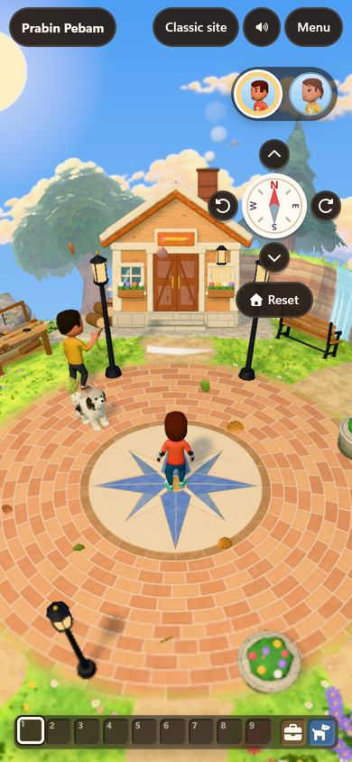
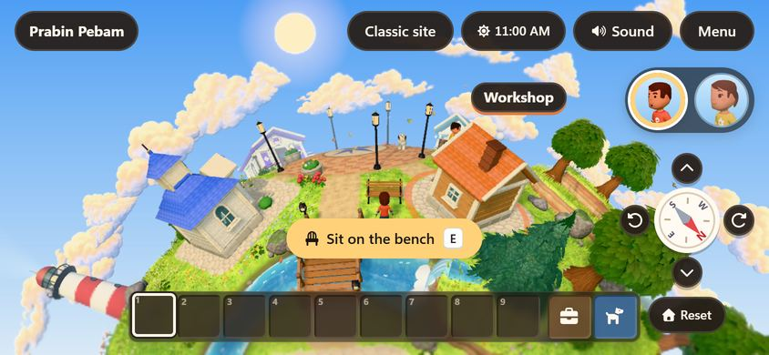
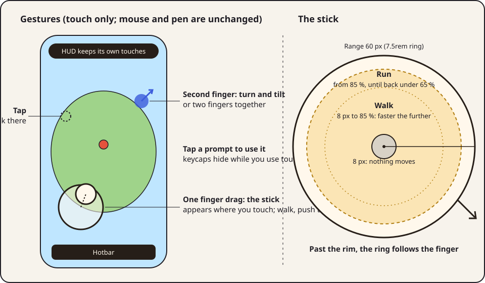
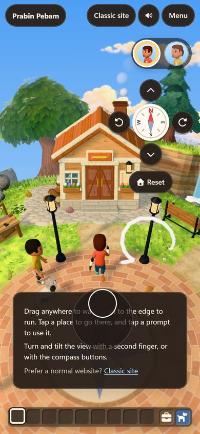
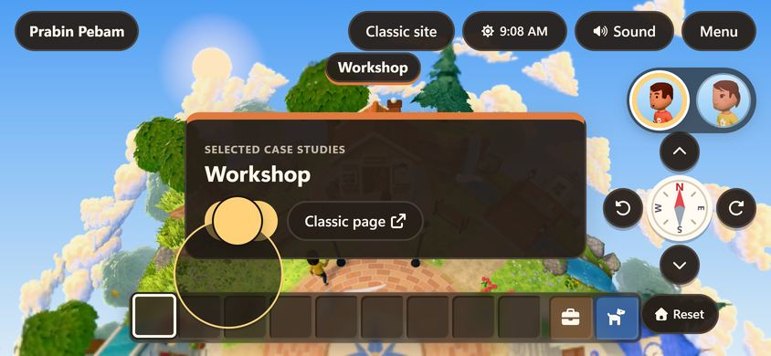

# Touch controls: research, audit, spec v1, critique, v2

This is the working spec and plan for playing the planet on a smartphone: a floating stick you summon by touching anywhere, the gestures around it, and the HUD changes that make the rest of the game work under a thumb. The living rules are in [the design system](design-system.md) §10; the planet's control table is in [the planet spec](../poc-3d-navigation/spec.md) §4.5.

> **TL;DR.** On a phone the planet already renders well, but it only listens like a desktop: one-finger drag turns the view, the only way to walk is to tap a spot, the prompts show <kbd>E</kbd>, the start card says W A S D, and the view buttons are 34 px. V2 makes one finger *walk*: touch anywhere on the planet and drag, and a stick appears under your thumb; push to the edge to run. A second finger (or two fingers together) turns and tilts the view, the compass buttons still do, and a tap still walks to a spot. The HUD follows the **last input you used** (touch or keys) rather than guessing from the device, so keycaps and copy swap on a hybrid laptop too. It all ships as a small chunk loaded only on touch-capable devices, so the desktop bundle and behaviour don't change.

## 1. Research: what the practice says

Anything marked *opinion* is a synthesis with no single source.

**The floating stick is the norm for free movement on phones.**
- nipplejs, the most used web joystick, defaults to a **dynamic** mode: a stick is created where the finger lands and removed when it lifts. Its defaults are a 100 px ring (the knob is half that) and a 0.1 threshold before any direction registers; an optional **follow** mode drags the ring along when the finger passes the rim ([README](https://github.com/yoannmoinet/nipplejs)).
- Unity's on-screen stick moves within a box centred on the pointer-down point, 50 px by default (its *movement range*) ([Input System manual](https://docs.unity3d.com/Packages/com.unity.inputsystem@1.11/manual/OnScreen.html)).
- Action games with a camera to steer split the screen: a floating stick on the left, a camera drag on the right. *Sky: Children of the Light* also has a one-handed mode that moves with one finger and turns the camera with a two-finger drag ([community wiki](https://sky-children-of-the-light.fandom.com/wiki/Menus_and_Controls)).
- Cosy sims with a fixed camera (for example *Animal Crossing: Pocket Camp*) move by tapping a spot.
- *Opinion:* the pattern to copy is floating, follow, a small dead zone, and push-to-run. None of the sources needs a fixed on-screen stick for a game like this.

**Phones are held in one hand as often as two.** In Hoober's field study of 1,333 people, 49 % held the phone in one hand and worked it with the thumb ([UXmatters, 2013](https://www.uxmatters.com/mt/archives/2013/02/how-do-users-really-hold-mobile-devices.php)). A control scheme that needs the left thumb for movement locks out half of portrait play.

**Tap and drag need one threshold.** Android treats a touch as a drag once it moves past the *touch slop*, 8 dp by default ([ViewConfiguration](https://developer.android.com/reference/android/view/ViewConfiguration#getScaledTouchSlop())). The game's taps already allow 6 px (R3F's `delta` check), so the stick must not start inside that.

**The web platform's traps.**
- `touch-action: none` stops the browser panning and zooming the element; `manipulation` keeps panning but drops double-tap zoom, which also removes the tap delay on buttons ([MDN](https://developer.mozilla.org/en-US/docs/Web/CSS/touch-action)).
- `overscroll-behavior: none` stops the bounce and pull-to-refresh ([MDN](https://developer.mozilla.org/en-US/docs/Web/CSS/overscroll-behavior)); `-webkit-touch-callout: none` stops the iOS long-press callout ([MDN](https://developer.mozilla.org/en-US/docs/Web/CSS/-webkit-touch-callout)).
- System gestures (the home bar, Android's back swipe, a notification) end a touch with `pointercancel`, never `pointerup` ([MDN](https://developer.mozilla.org/en-US/docs/Web/API/Element/pointercancel_event)).
- Without `viewport-fit=cover`, Safari keeps the page inside the safe areas and fills the notch bars with the page background; `cover` hands them to the page, which then has to pad everything with `env(safe-area-inset-*)` ([MDN viewport](https://developer.mozilla.org/en-US/docs/Web/HTML/Reference/Elements/meta/name/viewport), [MDN env()](https://developer.mozilla.org/en-US/docs/Web/CSS/env)).
- The Vibration API isn't available in Safari ([MDN](https://developer.mozilla.org/en-US/docs/Web/API/Vibration_API)), and `screen.orientation.lock()` works only in fullscreen, where it's supported at all ([MDN](https://developer.mozilla.org/en-US/docs/Web/API/ScreenOrientation/lock)).

**Accessibility.**
- [WCAG 2.5.7](https://www.w3.org/WAI/WCAG22/Understanding/dragging-movements.html): anything done by dragging needs a single-pointer alternative. [2.5.1](https://www.w3.org/WAI/WCAG22/Understanding/pointer-gestures.html): multi-finger gestures need one too.
- [2.5.8](https://www.w3.org/WAI/WCAG22/Understanding/target-size-minimum.html): targets at least 24 px; 44 pt is Apple's minimum ([HIG](https://developer.apple.com/design/human-interface-guidelines/accessibility)) and 48 dp Android's ([guide](https://developer.android.com/guide/topics/ui/accessibility/apps#large-controls)).
- [1.3.4](https://www.w3.org/WAI/WCAG22/Understanding/orientation.html): don't lock the orientation. [1.4.4](https://www.w3.org/WAI/WCAG22/Understanding/resize-text.html): don't block pinch zoom of the page (`user-scalable=no`).
- The [Game Accessibility Guidelines](https://gameaccessibilityguidelines.com/full-list/) ask for virtual controls that are large and well spaced on small touch screens.
- Games swap their button glyphs to the device you last used, not the one you own ([interaction research](../poc-3d-navigation/research/interaction-design.md)); browsers pick `:focus-visible` the same way ([MDN](https://developer.mozilla.org/en-US/docs/Web/CSS/:focus-visible)).

## 2. Audit: the game on a phone today

Captured on Chromium with touch emulation (iPhone 13 size, 390 × 844 and 844 × 390); the device is correctly treated as coarse and gets the low-quality tier.

  <figure class="slate-figure">
    
    <figcaption>Portrait: the view pad's buttons are 34 px, the hotbar slots 28 px.</figcaption>
  </figure>
  <figure class="slate-figure">
    
    <figcaption>Landscape: the prompt shows an <kbd>E</kbd> keycap a phone doesn't have.</figcaption>
  </figure>

| # | Finding | Why it matters |
|---|---|---|
| A1 | One-finger drag turns and tilts the view | The most natural thumb gesture doesn't move you |
| A2 | Walking is tap-to-walk only | No steering, no stopping, no running control |
| A3 | Prompts and the preview card show <kbd>E</kbd> / <kbd>Esc</kbd>; hotbar slots show 1 to 9 | Glyphs for keys the device doesn't have |
| A4 | The start card says "Walk with W A S D"; the controls hint lists only keys; "Press E to open" is announced | Wrong instructions for touch |
| A5 | View buttons are 34 px, Reset 40 px | Under the 44 px rule |
| A6 | Hotbar slots are 28 px on a 360–390 px portrait phone | Over WCAG's 24 px minimum, under 44 px: nine slots plus two buttons must fit |
| A7 | HUD buttons have no `touch-action`, the planet has no callout or selection guard, the page has no overscroll guard | Double-tap zoom on a button, long-press callouts, pull-to-refresh |
| A8 | Nothing handles `pointercancel` beyond ending the view drag | A system gesture mid-walk must stop the character |

What already works: the planet has `touch-action: none`, the canvas fills `100dvh`, both orientations lay out, every HUD control is a real button, and the inventory has touch rules of its own (tap, long-press, a Move toggle; [collecting](../poc-3d-navigation/collection-inventory.md) §4).

## 3. Spec and plan v1 (first draft)

1. **Split screen.** A floating stick in the left half; a camera drag in the right half.
2. **nipplejs 1.0.4** in dynamic mode, 100 px, threshold 0.1.
3. **A run button** at the bottom right.
4. **`viewport-fit=cover`**, with `env(safe-area-inset-*)` padding on every region.
5. Hide keycaps under `@media (hover: none) and (pointer: coarse)`.
6. A 50 px range in CSS px; a 10 % dead zone.
7. **Haptics** (`navigator.vibrate`) when running starts and on arrival.
8. **Drop tap-to-walk** on touch, so taps and the stick can't conflict.
9. Ship it in the main bundle, for every device.
10. **Lock landscape** with `screen.orientation.lock('landscape')`.

## 4. Critique of v1

| v1 | Problem | v2 |
|---|---|---|
| 1 Split screen | Not what was asked ("anywhere"), and it breaks one-handed portrait play: a right thumb could only turn the camera | The stick starts anywhere; a *second* finger, or two fingers together, turns the view |
| 2 nipplejs | About 6 KB gz against 0.3 KB of headroom in the 450 KB budget; its DOM carries inline colours (the tokens rule) and its own listeners would fight tap-to-walk. We need about 100 lines | A pure `Stick` and gesture router of our own, unit-tested, in a lazy chunk |
| 3 Run button | One more persistent control in the thumb zone, and it needs a second thumb | Push to the rim to run, with hysteresis (on at 85 %, off under 65 %) |
| 4 `viewport-fit=cover` | Every region and the canvas would need insets; the default already keeps the HUD out of the notch, and the sky gradient on `body.play` fills the bars | Keep the default viewport |
| 5 Media query | A touchscreen laptop with a keyboard would lose its keycaps, and a phone with a keyboard would keep none | Follow the last input: `data-input` on `<html>`, from the last pointer or key |
| 6 Fixed px size | Ignores Larger text | A rem-based `c.stick.size` token; the range is read from the drawn ring |
| 7 Haptics | Not in Safari at all; buzzing on every run is noise | Deferred |
| 8 Drop tap-to-walk | Fails WCAG 2.5.7: the drag would have no single-pointer alternative | Keep tap-to-walk; taps are under 6 px, the stick starts past 8 px |
| 9 Main bundle | Desktop pays for code it never runs, and the budget has 0.3 KB | Loaded only when `(any-pointer: coarse)`; the main bundle keeps a few lines of glue |
| 10 Orientation lock | Fails WCAG 1.3.4, and Safari can't lock outside fullscreen | Both orientations; the portrait layout exists |
| Missed | v1 forgot the 34 px view buttons, "Press E" announcements, the W A S D start card, `pointercancel`, double-tap zoom on buttons and the long-press callout | All in v2 (§5.4–5.6) |

## 5. Spec v2

<figure class="slate-figure">
  
  <figcaption>The gestures, and the stick's geometry (drawn at three times size).</figcaption>
</figure>

### 5.1 Gestures

Touch pointers only (`pointerType === 'touch'`). The mouse and pen keep today's behaviour exactly: drag turns and tilts, click walks.

| Gesture on the planet | Result |
|---|---|
| Tap (under 6 px of movement) | Walk to that spot, or use the building tapped (unchanged) |
| One finger, alone, moves past 8 px | The stick appears at the touch-down point; walk the way the knob points (screen-relative, like W A S D) |
| Push past 85 % of the range | Run, until the knob comes back under 65 % |
| Drag past the rim | The ring follows the finger, so reversing is instant |
| A second finger while the stick is held | That finger turns (left–right) and tilts (up–down) the view |
| Two fingers down before the first moved | Both turn and tilt the view (their movements are averaged); no stick |
| Pinch | Nothing: the POC has no zoom, and the planet blocks browser zoom (`touch-action: none`) |
| Lift, `pointercancel`, or the page hidden | The stick goes; the character eases to a stop |
| Seated, and the stick starts | Stand up (like a fresh key press), then walk while it's held |
| Talking, a dialog, the menu, the backpack | No stick: the planet isn't taking input |

The HUD keeps its own touches: a touch that starts on a button never becomes a stick.

### 5.2 The stick

| Parameter | Value | Why |
|---|---|---|
| Ring | `c.stick.size` 7.5rem (120 px), knob `c.stick.knob` 3.5rem | nipplejs's default is 100 px; rem so Larger text scales it |
| Range | Half the drawn ring (60 px) | Measured from the element, so the token is the one source |
| Dead zone | 8 px (13 % of the range) | Android's touch slop; clear of the 6 px tap |
| Walk | Intent 0.35 → 1 of walking speed across 8 px → 85 % | Fine steering near the centre without a moonwalk crawl |
| Run | On at ≥ 85 %, off under 65 % | Hysteresis: no flicker at the threshold |
| Follow | Past the rim the centre moves with the finger | nipplejs `follow`: no stretching, instant reversal |
| Look | Wood glass ring, wood knob; gold (`--surface-accent`) while running | The game's surface; running reads at a glance |
| Motion | Fades in and out at `--dur-fast`; instant under reduced motion | |
| Layer | `--layer-stick` (22), inside the planet region, `pointer-events: none` | Over the lanes (a card must never hide the stick under the thumb), under the travel fade and the chrome |
| Accessibility | `aria-hidden`; Prabin's welcome and the How to play page say what it does | A pointer affordance, not information |

### 5.3 Input modality

- `<html data-input="touch|keys">`, set by the last `pointerdown` (touch → `touch`; mouse or pen → `keys`) or `keydown` (→ `keys`). It starts as `touch` when the primary pointer is coarse. The store mirrors it (`input`), so React copy can follow.
- The chunk that sets it loads only on touch-capable devices; everywhere else it stays `keys`, and nothing changes.

### 5.4 HUD in touch mode

| Where | Change |
|---|---|
| Buttons (prompt, preview card, stand up, feed the ducks) | Keycaps (`<kbd>`) hidden |
| Hotbar | Slot numbers hidden |
| Prabin's welcome and How to play (they replaced the start card and the controls hint) | "Drag anywhere to walk; push to the edge to run. Tap a place to go there, and tap a prompt to use it." / "Turn and tilt the view with a second finger, or with the compass buttons." |
| Near a building (announced) | "Tap Open." instead of "Press E to open." |
| View pad, Reset | 44 px (`c.view.btn-touch`, `c.btn.h`) |
| Short screens (a phone held sideways, ≤ 500 px tall) | Count as compact (`COMPACT_QUERY`), so the aside gives way to a lane card, and the preview card drops its summary: a 390 px screen can't hold both, or the full card |
| Small phones upright (touch, ≤ 700 px tall; Safari's toolbars leave an iPhone 13 390 × 664) | The preview card drops its summary too, so it clears the view pad and Reset. At ≤ 600 px (an iPhone SE, 375 × 553) Reset moves beside the pad; the card may still cover the lower third of the tilt-down button there |
| Hotbar slots | Unchanged: 28 px at 360 px portrait (WCAG 2.5.8), 48 px in landscape. The one sanctioned exception to 44 px: nine slots, the backpack and the whistle must fit a phone held upright |

### 5.5 Platform hygiene

- HUD buttons and links: `touch-action: manipulation` (no double-tap zoom, no tap delay). The slots keep `none` for dragging.
- The planet region and HUD controls: `-webkit-touch-callout: none`, `user-select: none`, `-webkit-tap-highlight-color: transparent` (they have their own pressed states).
- `body.play`: `overscroll-behavior: none`.
- The viewport meta stays as it is: no `user-scalable=no` (1.4.4), no `viewport-fit=cover` (§4).
- Both orientations; nothing is locked.

### 5.6 Architecture

| Piece | Where | Bundle |
|---|---|---|
| `Stick`: dead zone, walk and run mapping, follow, knob offset | [`input/stick.ts`](https://github.com/prabinpebam/atiya/blob/main/src/game/input/stick.ts), pure, unit-tested | touch chunk |
| `TouchGestures`: which finger is the stick, which turn the view, averaging, tap-vs-drag | [`input/gestures.ts`](https://github.com/prabinpebam/atiya/blob/main/src/game/input/gestures.ts), pure, unit-tested | touch chunk |
| DOM: the stick element, window listeners, `pointercancel` and `visibilitychange`, the modality attribute, the touch copy | [`input/touch.ts`](https://github.com/prabinpebam/atiya/blob/main/src/game/input/touch.ts) (`attachTouch`) | touch chunk |
| Glue: a `touch` attachment; the region's `pointerdown` hands touch pointers to it; the stick drives `keyboard.override` | [`controller.ts`](https://github.com/prabinpebam/atiya/blob/main/src/game/controller.ts), [`game-mount.tsx`](https://github.com/prabinpebam/atiya/blob/main/src/game/game-mount.tsx) | main (a few lines) |

- The chunk imports nothing from the main bundle but types: it gets the controller and reads what it needs from it (the same rule as the nature chunk, so the main bundle's shared chunks don't re-split).
- `game-mount.tsx` imports it only when `matchMedia('(any-pointer: coarse)')` matches, alongside the other chunks, so it's there before the first frame.
- The stick sets `keyboard.override`, the same analog intent path the sim already scales (`Math.min(1, len)` of walk or run speed), so movement, collisions, wading and seats need no changes.

### 5.7 Plan

| Step | Work | Validation |
|---|---|---|
| 1 | `Stick` and `TouchGestures`, pure | Unit tests: dead zone, walk ramp, run hysteresis, follow, tap vs drag, second finger, two fingers together, cancel |
| 2 | `touch.ts` chunk, controller glue, the conditional import | `tsc`; bundle budgets (`verify:prod`) |
| 3 | Tokens (`c.stick.*`, `c.view.btn-touch`), CSS for the stick, touch-mode sizes and hygiene | `designSystem.test.ts` |
| 4 | Touch copy: start card, hint, announcement; keycaps and slot numbers hidden | Unit (copy rules); E2E |
| 5 | E2E on an emulated phone with real touch events (CDP `Input.dispatchTouchEvent`): the stick walks and runs, lifting stops, a second finger turns the view, a tap still walks, keycaps hide | New "touch" group |
| 6 | Desktop regression: the mouse drag, tap and keyboard tests | "view controls" group |
| 7 | Screenshots on a real GPU, portrait and landscape, stick showing | Viewed |

### 5.8 As built

  <figure class="slate-figure">
    
    <figcaption>Portrait, walking: the stick over the hint (touch copy), 44 px view pad.</figcaption>
  </figure>
  <figure class="slate-figure">
    
    <figcaption>Landscape, running: the gold stick; the short preview card, and no hint beside it.</figcaption>
  </figure>

- Built as §5.1–5.6, with three changes found on the phone:
  - **The stick's layer** moved from `--layer-base` to a new `--layer-stick` over the lanes: under the hint or a preview card, it vanished exactly where the thumb was.
  - **The hint lets touches through** (`pointer-events: none` in touch mode, its link excepted): in portrait it sits where the thumb rests, and a first drag there did nothing.
  - **Short screens count as compact**, and the preview card drops its summary there: held sideways, the card and the hint overlapped, and the card reached the top bar.
  - **Small phones upright** (found on the live site with Safari's real visible height, 390 × 664): the card covered Reset. On touch at ≤ 700 px it drops its summary as well, and at ≤ 600 px Reset sits beside the pad. Checked at 390 × 664, 375 × 553, 390 × 844 and 844 × 390; a laptop's short window (1366 × 650) keeps the full card.
- Announcements are reworded in the chunk (`forTouch`: "Press E to open." becomes "Tap Open."), so the main bundle carries no second set of strings. The site card's hint and Prabin's one line that said "press E" follow the input too, or no longer name a key.
- **Budgets:** the game's initial JS went from 449.7 to 449.9 KB gz (limit 450); the touch chunk is 1.8 KB, and on-demand JS is 77.2 KB (limit 80). A mouse-only device never requests the chunk.

## 6. Definition of Done

| # | Item | Evidence | Status |
|---|---|---|---|
| 1 | Touch and drag anywhere on the planet summons the stick; walking follows it, screen-relative | E2E "touch"; unit `touch.test.ts` | Done |
| 2 | Push to the rim runs; back under 65 % walks | Unit (stick hysteresis), E2E (`run` class) | Done |
| 3 | Lifting, `pointercancel` or hiding the page stops the character | E2E (position unchanged after lifting); unit (`reset`) | Done |
| 4 | A second finger, or two together, turns and tilts the view; the compass buttons still do | E2E (north turns more than 20° while walking); unit (averaging) | Done |
| 5 | A tap still walks to a spot or uses a building (WCAG 2.5.7) | E2E | Done |
| 6 | Keycaps and slot numbers hide, and the copy follows the last input | E2E (start card, hint, prompt keycap hidden); unit (`forTouch`) | Done |
| 7 | View buttons and Reset are 44 px on touch | E2E (measured 44 × 44) | Done |
| 8 | No double-tap zoom on HUD buttons, no callout, no pull-to-refresh | CSS review ([`hud.css`](https://github.com/prabinpebam/atiya/blob/main/src/styles/hud.css)); needs a pass on a real iPhone and Android phone | Done (emulated) |
| 9 | Desktop unchanged: mouse drag turns the view, keyboard walks | "view controls" E2E (4 tests) | Done |
| 10 | Budgets met: initial ≤ 450 KB, on demand ≤ 80 KB; nothing loads on a mouse-only device | `verify:prod`; the import is behind `(any-pointer: coarse)` | Done |

## 7. Deferred, with reasons

- **Haptics:** no Vibration API in Safari; revisit if the owner wants an Android-only tick.
- **Pinch zoom:** the planet has no zoom (spec P1 "zoom stops").
- **A left-handed or fixed-stick option:** the floating stick has no side; a fixed stick would be a setting, not needed yet.
- **Gamepad:** unchanged (spec P1).
