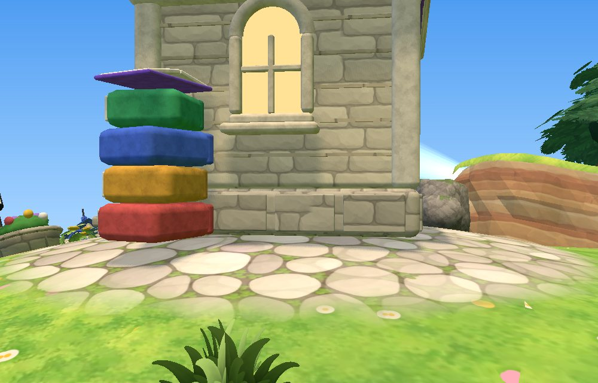
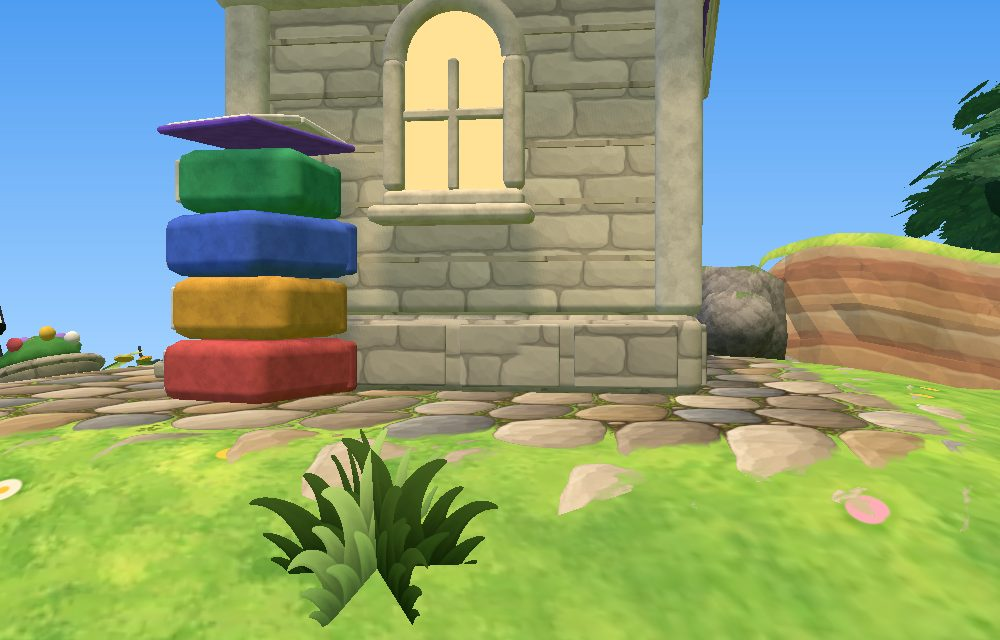
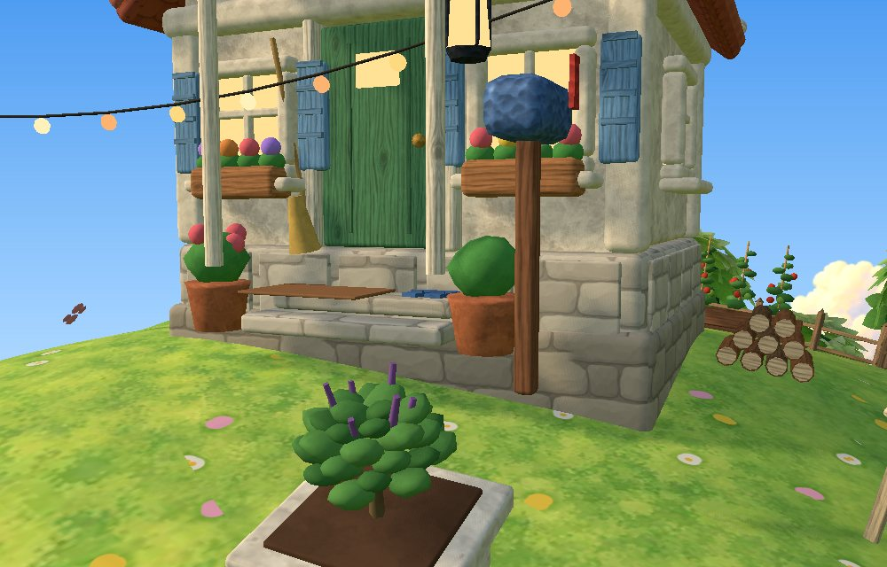
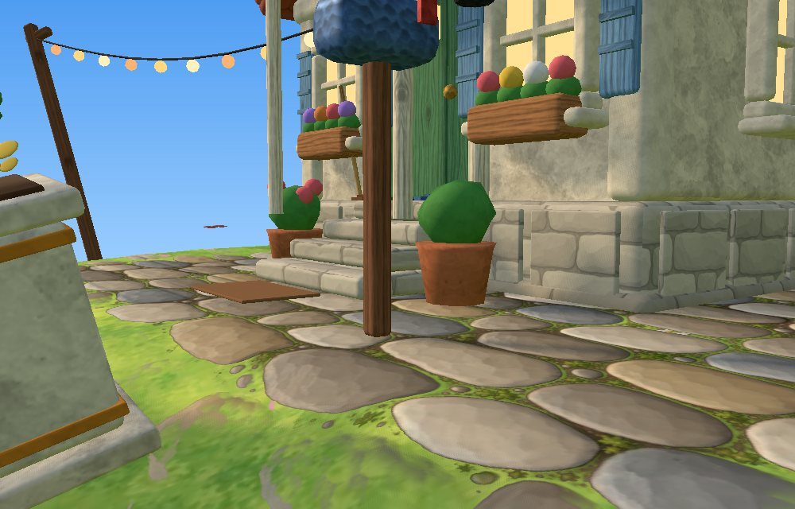
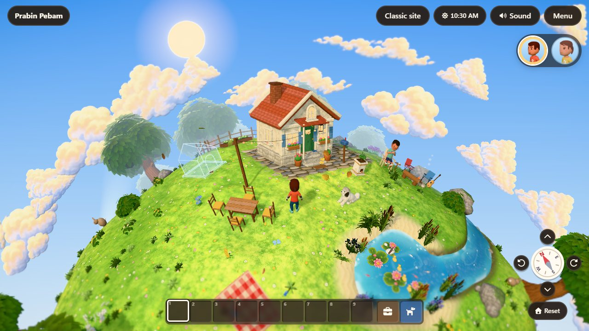
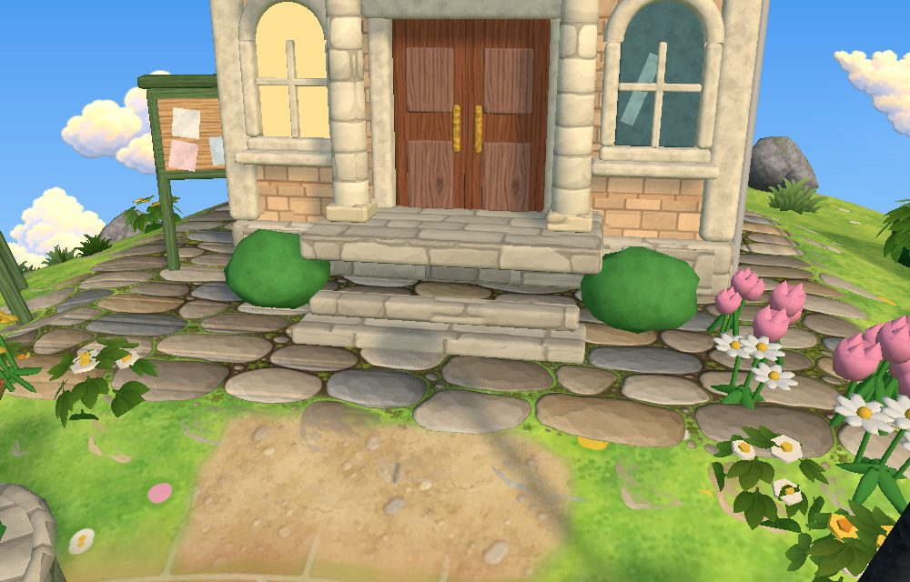
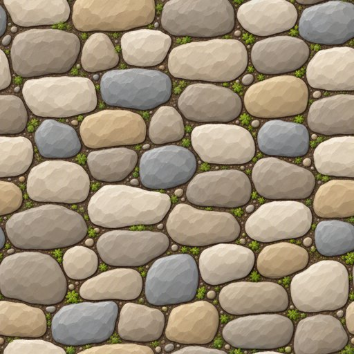

# Levelled ground and cobbles

Every structure on the planet now stands on ground shaped to its base, and the stone aprons around the buildings use a painted cobble tile with real relief.

## The problem

- **Curvature.** A structure is modelled flat in the tangent frame at its centre, but the radius-10 planet curves away under it by d²/2R. That is 0.2 u at 2 u from the centre, so the corners of a big building floated.
- **Undulation.** The rolling hills added later (`Terrain.undulation`) made it worse: the ground under a base rose on one side and fell on the other.
- **The Home** was lifted 0.12 u to clear the hills. Its doormat and letterbox floated, and its two steps stopped short of the ground.
- **The Town Hall steps** ended in a gap above the plaza.
- **The cobbles** were a pale, flat tile, mapped triplanar (which ghosts at mid latitudes) in a round band at footprint + 0.5 u. They didn't match the painted assets.

## Approach: pads, as in city builders

Games that place buildings on terrain (city builders, farm sims, Zelda-like level kits) level the ground under the building ("flatten" or "terraform" brushes). They don't bend the building. The same is done here:

- **A pad per structure** (`world/pads.ts`, pure). It has a base box in the structure's frame, a flat `margin` beyond it, and a `skirt` that blends back to the natural ground with a smoothstep.
- **The flat part is the tangent plane at the centre.** Its height is `(R + h) / (n·n₀) − R`, which is exactly the plane the model was built in. Ground triangles whose vertices are all inside the margin lie exactly on it. Vertex spacing is about 0.21 u, so margins are 0.3 u where there's room.
- **Fitted, not fixed.** Each plane's `h` is the mean of the ground under it (cut equals fill), so a big building on a slope sinks a little on the uphill side instead of standing on a mound. Pads are fitted biggest first, each to the ground the bigger ones have left, so a bench in a forecourt sits on the forecourt.
- **Neighbours.** `separatePads` shrinks overlapping margins until they're 0.04 u apart. Between two pads' skirts, the lift is a blend with inverse-distance weights. Two nearby planes tilt to different radials, so neighbours are kept spaced out (the reading chair and the dog house moved, and the woodpile shares the house's pad) to avoid a crease.
- **Water and mesas.** A skirt is clipped to stop about 0.2 u short of water, so no pad lifts a river bank or the pond shore. Pads never cut a mesa: the height is `max(pads(lowland), mesa)`.
- **Structures are placed on their pads.** Landmarks stand at `R + terrain.height(n) − 0.01`. The landmark's glowing ring (world/cues.tsx) is draped on the terrain. The home, family and yard read `terrain.height` as before.

### Where pads come from

| Source | File | Pads |
|---|---|---|
| Main bundle | `world/groundPads.ts` (`structurePads`) | Every landmark (base box per variant, measured from the model at y < 0.3; cobble apron 0.55 u; the Town Hall's includes its notice board), the storage chest, the crafting table, the benches (by the bridge and by the pond) |
| Home chunk | `world/home/homePads.ts` (`homePads`) | The house and woodpile (apron 0.45 u), the dog house, the picnic table and chairs, the campfire ring, chairs and log, the reading corner, the two beds, the tulsi (a point pad: round flat ground 0.32 u and a round cobbled spot 0.6 u) |

The home pads arrive with the home chunk: `controller.attachHome` calls `terrain.addPads(h.pads)` and then restamps the prop heights. This happens before the scene mounts, so the ground mesh sees them all. They're kept out of the main bundle, which is at its 450 KB budget.

## Cobble aprons

- **Planar UVs.** Each ground vertex has an `aCob` attribute: the in-plane (gnomonic) coordinates of the nearest apron pad. The stones stay square to the building and don't ghost. Past an apron's edge the coordinates still come from the nearest pad (with weight 0), so they interpolate smoothly across the edge triangles; zeros there caused zigzag smears.
- **The edge.** The apron weight is 1 inside `box + apron` and softens over `APRON_SOFT` (0.18 u). In the shader, stones give way to grass by the stone's luminance plus noise, so the edge is ragged like laid stones, not a painted line.
- **The tile.** `cobble.png` was first regenerated as chunky, colourful cobbles. The owner found them too big, contrasty and out of style, so it was replaced (2026-09-26) through the [texture style pipeline](art-pipeline.md): small, pale flagstones painted against the concept art's paving, 1.5 u per tile (`COBBLE_TILE_U`), with gentler relief (`COBBLE_BUMP` 0.45). The prompt is in `assets-src/textures/cobble.prompt.txt`.
- **Relief.** `cobble-normal` is derived from the tile's luminance by `scripts/build-textures.py` (`NORMALS`). The shader perturbs the normal in a cotangent frame built from `dFdx`/`dFdy` of `vCob` (no tangent attribute), normalised with `inversesqrt(max(…))` per the NaN rules. The procedural fallback stays when a texture is missing.

## The Home's steps

`HOUSE_STEPS` (4 steps, rise 0.085 u, tread 0.15 u) reaches the 0.34 u floor from the ground. The doormat lies on the ground at the foot of the steps, the sandals sit on the top step, and the broom stands on the ground. The family's climb (`STEPS` in `FamilyView.tsx`) is derived from the same constants, so feet land on the treads.

## Screenshots

| Before | After |
|---|---|
|  |  |
|  |  |

## Definition of Done

| # | Criterion | Evidence |
|---|---|---|
| 1 | The ground under every structure's base equals its plane | `pads.test`: < 1e-4 u at base-box samples for every landmark, prop and home structure |
| 2 | Every structure has a pad whose box covers its model | `pads.test`: every landmark, the home and the bridge furniture have pads; the boxes of the landmarks, the cottage, Chopper's house, the crafting table, the bench and the beds contain their models' footprints and exceed them by less than 0.12 u |
| 3 | Flat parts never overlap; neighbours keep a gap | `pads.test`: gap > 0.1 u between every pair |
| 4 | Planes fit the land (no mounds or pits) | `pads.test`: mean cut/fill < 0.12 u, max < 0.45 u |
| 5 | Pads leave water and mesas alone | `pads.test`: skirts clear of water, flat parts off mesas, mesa heights unchanged |
| 6 | No creases or steps in the ground | `pads.test`: lift smoothness < 0.03 u (isolated), < 0.12 u (neighbours) |
| 7 | Cobble UVs are continuous past apron edges | `pads.test`; library screenshot |
| 8 | The Home's doormat, letterbox and steps touch the ground; the Town Hall steps meet the plaza | Screenshots above |
| 9 | Cobbles read as dimensional stones matching the painted assets | Screenshots above (real GPU) |
| 10 | No regressions | Full unit suite, `npm run check`, full E2E, `verify:prod` (game JS within 450 KB gz; textures within 1.5 MB) |

## Adding a structure

1. Add a pad spec: `groundPads.ts` for the main world, `homePads.ts` for the home. Give it a base box measured from the model, and an apron if it should have cobbles.
2. Place the model at `R + terrain.height(centre)`.
3. Keep it about 1 u clear of other pads so the planes don't crease; `pads.test` checks the gap, the fit and the coverage.

## Deferred

- Seen at grazing angles, the landmark aprons look a little softer and paler (texture filtering). They're fine from the game camera; anisotropic filtering or more contrast could help if it shows.
- Pads are planes. A structure on a steep slope would need a terrace (a retaining edge), which nothing needs yet.
