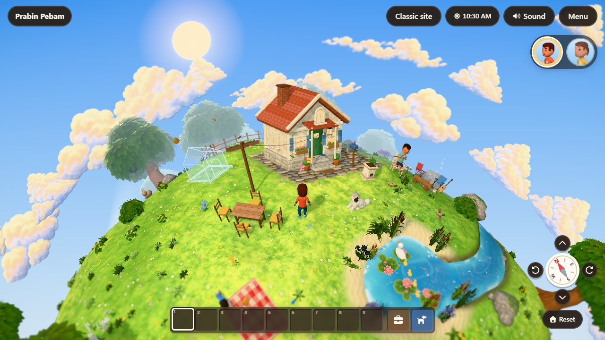
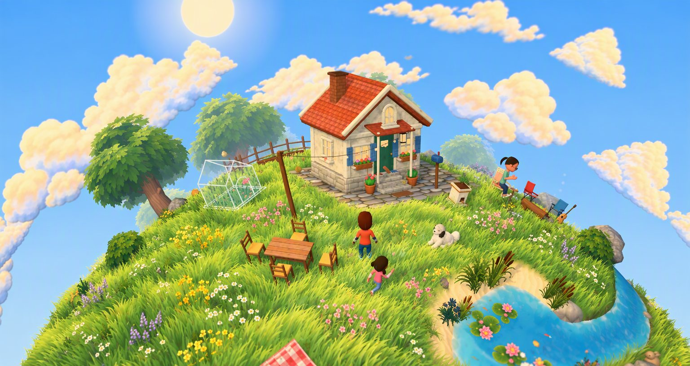
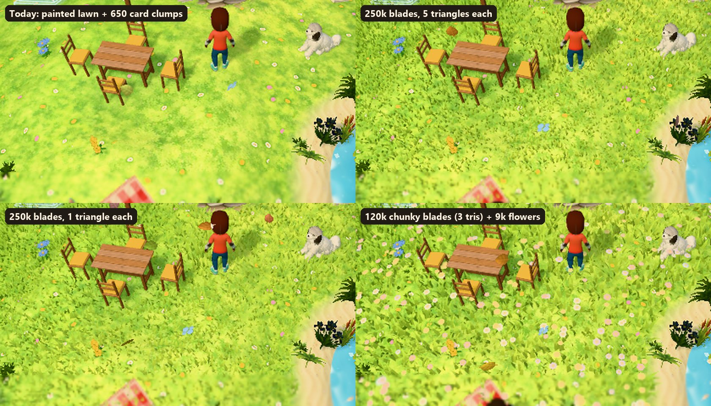
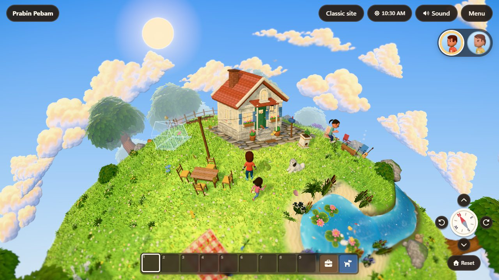
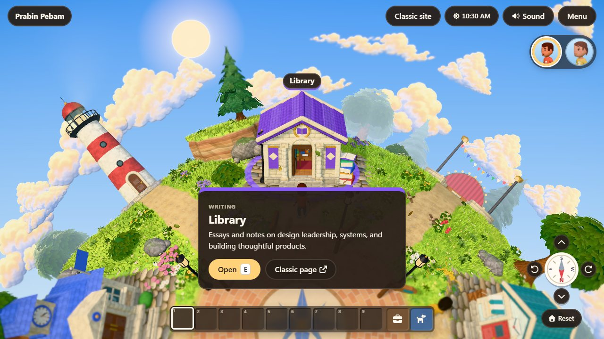
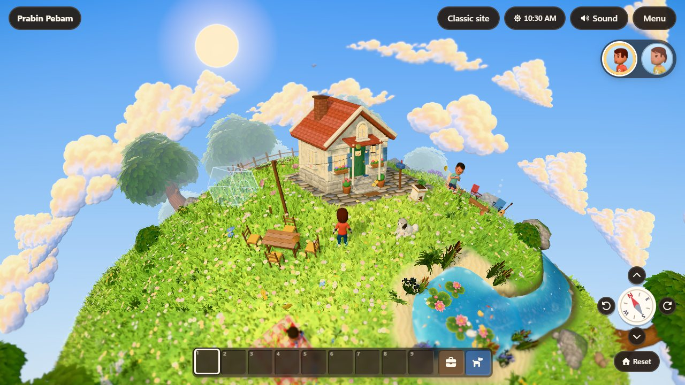
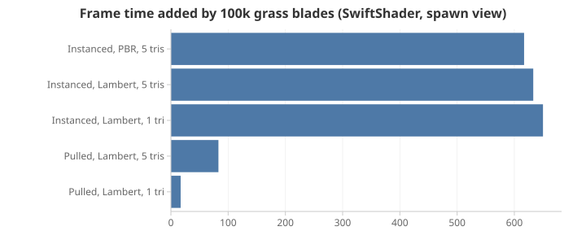

# Proposal: painterly blade grass and meadow flowers

> **TL;DR:** We can have a lush, painterly meadow with visible blades on phones, but not by copying the usual three.js tutorial. I built a prototype inside the running game and measured it.
> - The usual approach (one instance per blade) costs about **7× more** than building the blades in the shader from packed data ("vertex pulling"), drawn as 256-blade batches.
> - At our camera distance, a **chunky 3-triangle blade** reads as well as a detailed one.
>
> The recommended setup (140 K blades plus 9 K flowers, opaque, coloured from the ground, no blade textures) adds about 8 KB of code and about 3 MB of GPU memory. In a software renderer used as a weak-device proxy, all 140 K blades add **15 %** to the frame. The 40 % left when batches hidden behind the planet are skipped add **7 %**. It needs five owner decisions, two of which change rules in AGENTS.md, and a check on a real phone.

Evidence: [research](./research.md). What to build: [spec, plan and Definition of Done](./spec.md).

## What's wrong today

The lawn is a painted tile on the ground mesh, plus 650 grass clumps (three crossed alpha-tested cards each), flowering sprigs (about 150 triangles each) and full flower props (about 700). From our high camera the lawn reads as flat colour: there are no blades, no motion across the field, and no depth where the grass meets feet, chairs and paths. The [art direction](../art-direction/README.md) asked for a "sunlit meadow" with "abundant flowers", and the painted dots only hint at it.

## The target

The concept is a repaint of the prototype's screenshot (GPT Image 2.5, image-to-image; the prompt is in `screenshots/target-meadow.prompt.txt`), made the same way as the other [art direction](../art-direction/README.md) concepts. It keeps the composition and only changes the vegetation. Three things stand out:

- **Chunky blades.** They are bigger and fewer than real grass, and they lean together in soft clumps.
- **Flowers in drifts** of one colour, a little taller than the grass.
- **Grass colour continuous with the ground**, so there is no seam between the blades and the lawn.

## The prototype

I injected blade grass into the running dev game from a Playwright script (nothing in the repo changed). Blades are placed on the real ground mesh wherever its surface weights say lawn, and use the ground's own colour at the root.

| Prototype | Home | Plaza |
|---|---|---|
| 250 K fine blades (1 triangle) + 6 K flowers |  |  |
| 120 K chunky blades (3 triangles) + 9 K flowers |  | |

What it showed:

- **Blades read even at our distance.** The camera is 16 u from the character at a 35° field of view, so at 720p the ground near the character is drawn at about 71 px per unit. A 0.04 u blade is 3 px wide and a chunky 0.075 u blade is 5 px.
- **One triangle is enough for fine grass; chunky blades want a bend.** A 3-triangle blade (two segments) shows the curve that the concept's chunky blades have.
- **It exposes what the real version must handle.** Blades grow through the picnic mat and over the cobble edges and pond bowl, and cover the painted dots on the lawn. The spec adds an exclusion mask for all of these.

### What it costs

The RTX 4090 in this machine is limited by latency on this scene: even 400 K blades (2 M triangles) changed its GPU time by less than the noise (1.53 → 1.59 ms at DPR 1). So it says nothing about phones. As a weak-device proxy I measured the same scenes under **SwiftShader**, a CPU renderer where vertex and pixel work both show up. Its frame times are relative only, quantised to 16.7 ms steps, and vary by about ±30 ms between runs. Each comparison below comes from a single run.

| 100 K blades, spawn view (SwiftShader, 1280 × 720) | Frame without | With | Added |
|---|---|---|---|
| Instanced (one instance per blade), PBR material, 5 triangles | 550 ms | 1,167 ms | +617 ms |
| Instanced, Lambert, 5 triangles | 533 ms | 1,167 ms | +633 ms |
| Instanced, Lambert, 1 triangle | 533 ms | 1,183 ms | +650 ms |
| **Pulled** (one draw, blade built from `gl_VertexID`), Lambert, 5 triangles | 533 ms | 617 ms | +83 ms |
| **Pulled**, Lambert, 1 triangle (measured with 6 K flowers in the scene) | 567 ms | 583 ms | +17 ms |

- **Instancing tiny meshes is the trap.** With one instance per blade, neither a cheaper material nor fewer triangles changed the cost, so it is per-instance overhead. Vertex pulling removes it.
- **Pulled blades are vertex-bound.** Going from 5 triangles to 1 cut the added cost about 5×: 200 K blades added +184 ms with 5 triangles and +34 ms with 1.
- **The recommended look is affordable.**
  - 120 K chunky 3-triangle blades plus 9 K flowers added **+117 ms to a 483 ms frame (+24 %)**: +50 ms for the flowers (still one instance per flower in the prototype, so they pay the instancing penalty) and +67 ms for the grass. That is with every blade drawn, including the ~70 % hidden behind the planet.
  - **Batching is free.** Drawn as 256-blade batches in one instanced draw (the spec's design, which also allows hidden batches to be skipped), 140 K blades added +67 ms to a 450 ms frame (+15 %). 56 K blades, the share left after skipping, added +33 ms (+7 %). One single pulled draw measured the same within noise.
- **Load.** Placing and packing 140 K blades took **48–65 ms** in unoptimised JS, and **256 ms** with the CPU throttled 4× to approximate a phone.

## Options

| Option | Look | Phone cost | Verdict |
|---|---|---|---|
| A. Better painted lawn, more card clumps | Still flat from above; cards are alpha-tested | Alpha test defeats the tile GPU's hidden-surface removal | Doesn't reach the target |
| B. Shell texturing (stacked ground shells, like Chopper's fur) | Soft carpet, but no individual blades at this scale | Every shell is a full-screen alpha-tested layer: the worst case for tile GPUs | Rejected |
| C. Instanced blade meshes (the common tutorial) | Target look | Measured about 7× the cost of D | Rejected |
| **D. Vertex-pulled opaque blades, drawn as 256-blade batches in one instanced draw** | Target look | Lowest measured; no alpha, no textures | **Recommended** |

## What it means

### Loading time

- **Download:** no blade textures. Colour comes from the ground and a gradient, and the geometry is built in the shader.
  - The code is about 8 KB gzipped (an estimate). The main bundle is full (449.8 of 450 KB), and the on-demand chunks are at 65.5 of 70 KB. So the grass must be its own chunk, loaded alongside the textures, and the on-demand budget must grow (decision D3).
- **CPU at load:** placement is a pure TypeScript pass over the shared ground data. The spec's target is ≤ 30 ms of main-thread work on a desktop and ≤ 120 ms at 4× throttle, down from the prototype's 48–65 / 256 ms. It runs in short slices after the home and crafting chunks attach, while the textures finish, and no task may exceed 50 ms. `perf:audit` checks that time to playable stays within 5 %.
- **Shaders:** two programs (blades, flowers), compiled with the rest of the scene before the first frame.

### Frame rate

- **Visible budget.** From the camera about **30 %** of the planet is visible: with the camera about 24.9 u from the centre, the visible cap is (1 − R/D)/2. Each frame the CPU tests the ~550 batches with standard horizon culling against the planet's lowest ground, and draws only those that could show. With batches' sizes and blade heights, that is about 40 %, and no pixel changes. It needs decision D1: AGENTS.md currently forbids horizon culling.
- **Tiers.** Triangles actually drawn:

  | Tier | Blades | Triangles | Drawn after skipping |
  |---|---|---|---|
  | High | 140 K | 3 each: 420 K | about 168 K |
  | Low (phones) | 70 K | 3 each: 210 K | about 84 K |

  Flowers add 9 K (high) or 5 K (low) at 7 triangles each. For scale, the whole scene drew 681 K triangles across all passes at the [performance audit](../performance-audit.md), and Genshin draws 500–850 K.
- **Shadows.** Blades receive shadows but don't cast them, so the shadow pass is unchanged.
- **Adaptive quality.** Blade density becomes one of the adaptive steps (1.0 → 0.7 → 0.5). Each batch is sorted by a hash, so a lower density draws a shorter prefix of every batch, which really removes vertex work. The blades being removed first shrink to nothing over about half a second, so nothing pops.
- **Phones.** This is still unmeasured: no public WebGL grass demo publishes phone numbers either. The plan includes a check on the owner's phone before the blades ship on the low tier.

### Fundamentals

| Fundamental | How the design respects it |
|---|---|
| No alpha test or discard | Opaque blades and flower heads; the tile GPU keeps its early depth test |
| Thin-triangle cost | Chunky blades (5 × 9–19 px at 720p), 3 triangles; thickened when seen edge-on |
| Aliasing | 4× MSAA (high) / 2× (low) already on; chunky blades shimmer less; the tilt-shift softens the edges |
| No pop-in (owner rule) | Batches are skipped only when horizon culling proves them hidden (tested for identical pixels); density changes shrink blades over time |
| NaN safety | `pow` bases clamped, `inversesqrt(max(…))` normalisation |
| Day–night, lamps, fog | Same lighting as the ground; `withLampLights`; fog from the scene |
| Wind and pause | One shared wind function for props and blades; frozen under Pause ambient motion and Reduce motion |
| Readability | No blades on paths, plaza, cobbles, sand, water, mats or furniture bases; grass lies flat under feet and dropped items; decorative flowers kept clear of collectable flowers |

## How the image API helps

The blades need no sprites: at this size, a sprite would bring alpha testing and its costs. The image API is better spent on:

1. **The target look** (done above), for reviewing the art before the build.
2. **A calmer lawn tile** under the blades. Its painted dots and mottling fight the blades, so repaint it as soft colour drifts.
3. **A seamless "meadow drift" map** (large, soft colour patches) that sets where the grass is warmer or cooler and where each flower colour drifts.
4. The **item icons** for any new plants, through the existing icon pipeline.

## Decisions needed

| # | Decision | Recommendation |
|---|---|---|
| D1 | Allow horizon culling of grass batches: skip only batches that standard horizon culling proves hidden behind the planet (pixel-identical). AGENTS.md currently says "no horizon culling", so this amends it for grass | Allow, with the identical-pixels test at every camera extreme. Without it, the frame cost roughly doubles (+15 % instead of +7 % on the proxy) |
| D2 | Look: chunky clumped blades (the concept) or fine blades | Chunky |
| D3 | On-demand JS budget 70 → 80 KB for the grass chunk (the budget checker and AGENTS.md change with it) | Raise |
| D4 | Replace the 650 card clumps with blade tufts; keep the sprigs and collectable flowers | Replace |
| D5 | Phone check: which device, and blades on or off the low tier until it's done | The owner's phone; on at the low tier's density |

## Plan at a glance

The [spec](./spec.md) has the details and the Definition of Done.

1. **Data.** A shared ground-data module; placement, masks, batches and packing in a pure, unit-tested module.
2. **Blades.** The batched draw, shader, colour from the shared lawn model, wind, lighting, tiers, horizon culling.
3. **Meadow flowers** in drifts, batched the same way.
4. **Movers and drops.** Grass lies flat under feet and dropped items, and bends around the character, Chopper and the NPCs.
5. **Other plants.** Blade tufts replace the card clumps; the lawn tile is repainted and its painted dots removed.
6. **Validation.** `perf:audit`, NaN scan, the owner's phone, E2E, docs.
