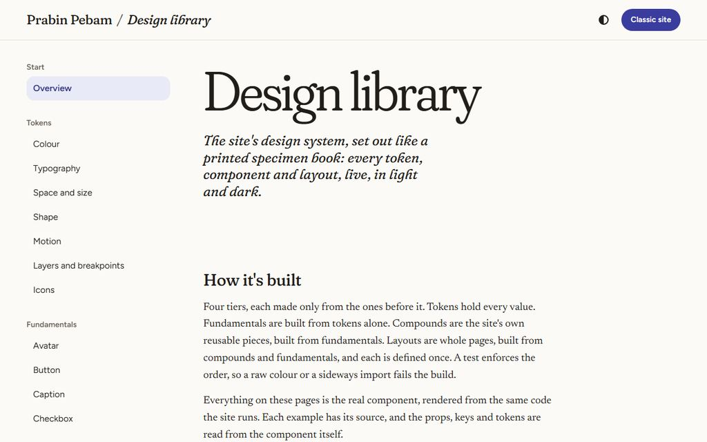
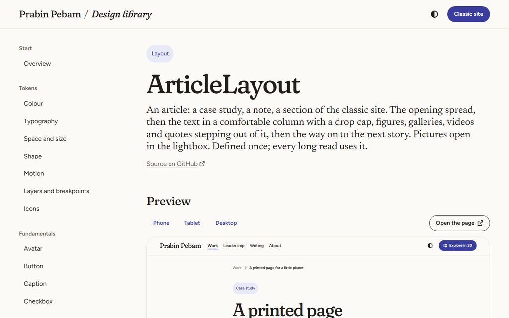

# Site design system

The rules for the website's pages: the landing, the classic site and the design library. The game has its own system ([game UI design system](../game-ui/design-system.md)); the two share nothing but the base-path helper. Read this before any change to the site's UI. The look is in [the visual language](visual-language.md), the reasoning in [the spec](spec.md), the tokens in [the reference](tokens.md), and the living catalogue at `/design/`.

> **TL;DR.** Four tiers: **tokens → fundamentals → compounds → layouts**, each made only from the tiers below it. Every value is a token; tokens are W3C DTCG 2025.10 with a light and a dark context. Fundamentals are sealed; compounds lay them out but never restyle them; layouts are whole pages, defined once; pages hold content and no styles. Every component documents itself (a doc comment and typed, commented props) and has a story, and the design library builds its pages from them. `tests/unit/siteDesignSystem.test.ts` enforces all of it.

## 1. Principles, in order when they conflict

1. **Pictures and words first.** The interface is quiet; whitespace is a token, not an accident.
2. **Accessible by default.** Native elements first; WCAG 2.2 AA in both modes; 44 px targets; the keyboard works everywhere; reduced motion honoured.
3. **One source per decision.** A value lives in a token, a behaviour in a pure module, a component in one file.
4. **Made only from what's below.** No sideways or upward imports; no reaching inside a lower tier's markup.
5. **Documented where it lives.** The component's own comments and types are its documentation.
6. **Nothing from a third party at run time.** Fonts are self-hosted; video embeds load nothing until pressed; no CDN.

## 2. Tokens (tier 0)

- **Source:** `src/site/design/site.resolver.json` (DTCG 2025.10).
  - The base set is `tokens.json`: primitives `p.*`, the type, space, shape, motion and layer scales, and the component tokens `c.*`.
  - The `theme` modifier adds `tokens.light.json` or `tokens.dark.json`, the colour roles.
  - The `contrast` modifier (`normal` or `more`) adds `tokens.contrast-more.json` when the reader asks for more contrast. It points the muted text, outlines and rules at their strong roles (aliases, so one file serves both themes), and the build writes them inside `@media (prefers-contrast: more)`.
  - Values use the 2025.10 objects (colours `{colorSpace, components, hex}`; dimensions and durations `{value, unit}`).
  - `$extensions` holds only vendor data: `site.fluid.min` (a fluid size's value at 360 px) and `site.unit` (a number's CSS unit, for tracking in `em`).
- **Build:** after any change, run `node scripts/build-site-tokens.mjs`. It writes `src/site/styles/tokens.css` and [tokens.md](tokens.md); never hand-edit either. The unit test fails on stale output.
- **Tiers of tokens:** a component reads semantic roles and scales (`--color-*`, `--text-*`, `--space-*`, `--radius-*`, …) or its own component tokens (`--c-button-*`). **Never a primitive (`--p-*`)**: only tokens and the library's token pages read them. A component token aliases a semantic role, never a primitive.
- **Modes:**
  - A colour role that differs between the contexts is emitted as `light-dark()`.
  - The page follows the system unless `<html data-theme="light|dark">` says otherwise. The header's theme switch sets it, `localStorage['site.theme']` keeps it, and PageShell applies it before the first paint.
  - Any subtree can switch with `color-scheme` (`data-scheme="dark"`; the lightbox is always dark). Never branch on the theme in CSS or script.
- **Fluid sizes:** type and whitespace grow between a 360 px and a 1280 px viewport, emitted as `clamp()`. A fluid token's maximum is at most 2.5 times its minimum (WCAG 1.4.4; tested).
- **Breakpoints:** `@media` can't read a variable, so width queries use exactly the breakpoint tokens: 40 rem, 56 rem, 72 rem (tested).

### Icons, behaviour and base (also tier 0)

- **Icons** are data: Font Awesome Free solid, by name, in `src/site/design/icons.ts`, drawn inline with `svgOf(name)`. Add an icon there before using it. No icon font, no CDN, no emoji or text symbol.
- **Behaviour** that isn't just DOM wiring is pure and unit-tested in `src/site/scripts/`:
  - `listbox.ts`: the select's APG keys and typeahead;
  - `theme.ts`;
  - `media.ts`: wrapping, swipes, the nearest slide;
  - `controls.ts`: the slider's values.
- **Base styles** (`src/site/styles/base.css`) set element defaults only: the reset, type, links, the focus ring, selection, and `.sr-only`.
- **Assets:** the font cuts in `src/site/assets/fonts/` (generated; §9).
- **Helpers:** `src/site/design/meta.ts` (the base path and the theme colours), `samples.ts` (the library's sample media) and `typography.ts` (curly quotes).

## 3. The tiers

| Tier | Folder | May import |
|---|---|---|
| 1: fundamentals | `src/site/components/fundamentals/` | Tier 0 only (no other component; icons through `svgOf`) |
| 2: compounds | `src/site/components/compounds/` | Fundamentals and tier 0 (no other compound) |
| 3: layouts | `src/site/layouts/` | Compounds, fundamentals and tier 0 (no other layout) |
| Pages | `src/pages/index.astro`, `src/pages/classic/`, `src/pages/design/` | Layouts, and components in their content; no `<style>` (the landing and classic pages) |

- **Fundamentals are sealed.** They take no `class` or `style` prop. They pass `data-*` attributes through, and set inline only data custom properties (`--fill`, `--focus`).
- **Compounds lay fundamentals out from their own elements.** Wrap a fundamental in the compound's own element to place or size it; never style inside it.
  - `:global` is banned, except where a component styles markup it didn't write: Prose (Markdown), and the Lightbox and VideoEmbed (elements their scripts create). The test holds this list.
- **One instance per page, composed by the layout.** Some pieces are page-wide: the Lightbox, for one. A compound that needs one never imports it. It marks its links (`a[data-lightbox="group"]`) and the layout places one `<Lightbox />`.
- **Place, don't position.** Figures, galleries, quotes and videos declare how far they step out of the text (`data-breakout="popout|wide|full"`); Prose's grid places them.
- **Layouts are defined once.** A page picks the layout that fits; a new kind of page gets a new layout only if no existing one fits, and that layout is then reused.
- **IDs are unique per instance** (a random suffix), so a page can show a component twice, as the library does.

## 4. Writing a component

1. **The file.** Create it in its tier's folder, named in PascalCase. Its frontmatter starts with a doc comment:
   - a plain-language summary: what it's for and when to use it (and when not);
   - `@tier fundamental|compound|layout`;
   - `@a11y` notes;
   - `@key Keys: action` lines if it takes keys.

   Every prop in `interface Props` has a JSDoc comment. Defaults go in the `Astro.props` destructuring, because the library reads them.
2. **Styles and script.** Styles are scoped, in the file, from tokens only. A client `<script>` initialises every instance by a `data-*` hook and guards against a second init. Logic beyond wiring goes in `src/site/scripts/` with a unit test.
3. **The story.** Add `src/site/stories/<Name>.stories.astro` with one `<Example title="…" description="…">` per variant or state. What's inside each Example is what the library shows as code, so keep it clean. Use `withBase()` for root-relative links, real copy about the site (never lorem ipsum or invented personal facts), and `SAMPLES` or `SAMPLE_VIDEO` for media. A layout's story is a whole page: the library frames it at `/design/demo/<slug>/`.
4. **Check it.** The library page appears by itself at `/design/<tier>/<kebab-name>/`. Run `npx vitest related <file> --run` and the "site design system" E2E group if it has behaviour.

## 5. The catalogue

The design library is the full, live version (examples, props, keys, tokens, uses and used by). In brief:

| Tier | Components |
|---|---|
| **Fundamentals** | **Type:** Heading, Text, Link, Caption, Prose, Quote, Tag, Divider. **Media:** Icon, Image, Video, Avatar. **Actions:** Button, IconButton. **Form controls:** Select (the custom dropdown), Checkbox, Radio, Switch, TextField, Slider. **Feedback:** Progress, Spinner, Skeleton. **Scrolling:** ScrollArea (the custom scrollbar) |
| **Compounds** | **Page frame:** PageShell, SiteHeader, SiteFooter, SideNav, Breadcrumbs, NextPrev. **Openings:** Hero, ArticleHeader. **Indexes:** StoryCard, ContentsList. **Media:** Figure, Gallery, Lightbox, Carousel, VideoEmbed. **Forms:** ChoiceGroup |
| **Layouts** | **LandingLayout** (the front page), **IndexLayout** (a section's front page), **ArticleLayout** (a long read: case studies, notes, the classic sections), **LibraryLayout** (the design library) |

## 6. The design library (`/design/`)

- **Built from the source.** `src/site/library/registry.ts` reads every component at build time:
  - the doc comment;
  - `interface Props`, through the TypeScript compiler;
  - the tokens its styles read;
  - its imports, which give "uses" and "used by";
  - its story.

  Nothing in the library is kept by hand: a component and its story are its page.
- **Examples:** each `<Example>` renders the real component, with a Light or Dark preview switch (it sets `color-scheme` on the canvas) and its source cut from the story file.
- **Token pages** (`src/site/library/tokens/`) show tokens as what they are, read from the resolved model, and are the one place primitives are shown.
- **Library-only helpers** (Example, CodeBlock, PropsTable, ViewportFrame, the token views) live in `src/site/library/`. They follow the token rules but aren't a tier: product code never imports them.

## 7. Accessibility

- **Contrast:** every text role passes 4.5:1 on every surface in both modes; outlines, the focus ring and checked fills pass 3:1; text on a picture sits on the image shade. The marigold highlighter is never text on paper; its type version (`--color-highlight-ink`) is. All tested.
- **Focus and targets:** a 3 px focus ring in indigo (light) or marigold (dark). Targets are at least 44 px; small buttons pad their hit area.
- **Native first:** real inputs (restyled with `appearance: none`), `<dialog>` for the lightbox, `
` for the side navigation's fold. The select follows the APG select-only combobox, key for key.
- **Motion:** reduced motion turns off every animation. There's no autoplay anywhere; the carousel doesn't rotate.
- **Structure:** one h1 per page; a skip link first; landmarks with names; `aria-current` on the current page; live regions for counters.
- **Checked by axe** in both modes on the library, the layouts and the pages (the E2E group).

### Phones and touch ([the mobile audit](mobile-audit.md))

- **Hover is an enhancement.** Every `:hover` rule sits inside `@media (hover: hover)`, so a tap never leaves a phone stuck in a hover state (tested). Anything with hover feedback also has a pressed state (`:active`) for touch.
- **No grey tap flash, no double-tap delay.** Base styles turn off the tap highlight and set `touch-action: manipulation` on controls; pinch zoom stays, and zoom is never disabled.
- **Reflow from 320 px:** no sideways scroll at any width (tested at 320, 360, 430 and 844×390). Long words break; running text hyphenates below 40 rem.
- **The first screen:** on a phone, upright or on its side, the page's heading (and the landing's primary action) is on it.
- **The header is compact on phones** (`--c-header-height-compact`, below 40 rem or 30 rem of height), tucks away while you read down, and returns on the way up or on focus.
- **Everything reachable on a phone:** the header's action moves into the menu (or to the footer where there's no menu). The menu closes on a tap outside and scrolls inside on a short screen.
- **Height queries** use the `short` breakpoint token (30 rem), as width queries use theirs.
- **Contrast settings:** `prefers-contrast: more` (iOS Increase Contrast) strengthens muted text to 7:1 or more, outlines to 4.5:1 and rules to 3:1 (tested). In forced colours, a state shown by a fill (the current page's pill) gets a non-colour mark too, such as an underline.

## 8. Copy

- **Case and labels:** sentence case. Buttons are verbs of three words or fewer; field labels are nouns; errors say what happened and how to fix it; no "OK", "Submit" or an instruction to click.
- **Symbols:** curly quotes and apostrophes in visible copy; no emoji or text symbols as icons.
- **Words:** the glossary is the game's (planet, classic site, the plaza), plus design library, standfirst, story.

## 9. Performance

- **No game code:** site pages load none (tested on the landing). Their scripts are small per-component modules.
- **Fonts, cut to what the site uses:** `python scripts/build-site-fonts.py` pins the axes the site never varies (Fraunces' SOFT and WONK, read from the `axes` tokens) and keeps optical size and weight. Newsreader is cut to the weights the tokens use. It writes `src/site/assets/fonts/` and `src/site/styles/fonts.css`; never hand-edit either.
  - **Weight:** 159 to 241 KB on a page, italics fetched only when used.
  - **Preloads:** each layout preloads the faces its first screen is set in (`PageShell`'s `preload`), so text doesn't re-wrap as fonts arrive.
  - **The playground:** only the library's type playground loads the full four-axis Fraunces (`--font-specimen`).
- **Pictures:** sized, `srcset`, lazy unless they're the lead. Videos load their metadata only.
- **Measured on a phone** (Lighthouse's mobile throttling): LCP under 2.5 s and CLS under 0.1 on the landing, the index and a section ([the mobile audit](mobile-audit.md) §4).

## 10. Checks

| What | Command |
|---|---|
| Tokens up to date | `node scripts/build-site-tokens.mjs --check` (also in the unit test) |
| Fonts up to date | `python scripts/build-site-fonts.py --check` |
| The rules | `npx vitest run tests/unit/siteDesignSystem.test.ts tests/unit/siteBehaviour.test.ts tests/unit/siteControls.test.ts` |
| In the browser | `npx playwright test -g "site design system|site on a phone|landing & classic"` |
| Types | `npm run check` |
