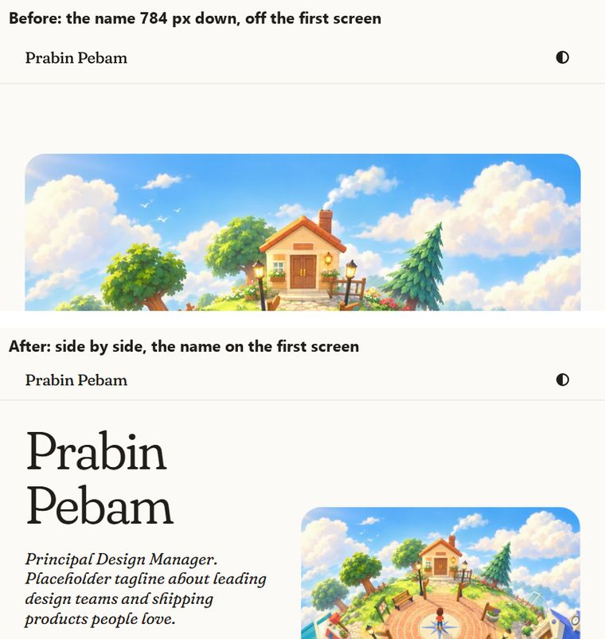
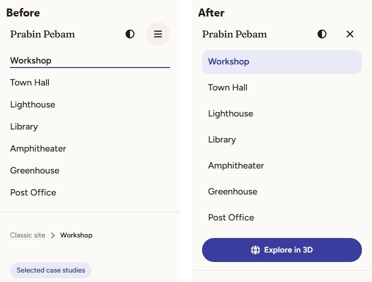
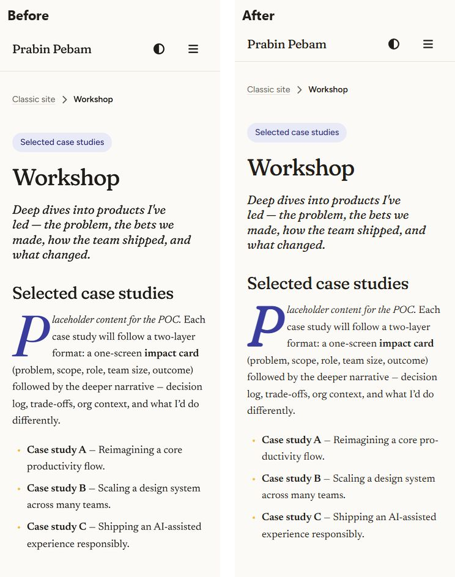

# The classic site on a phone: audit and fixes

An audit of the website on smartphones (the landing, the classic site and, in passing, the design library), what was wrong, what changed, and the numbers before and after. The system's rules for small screens are in [the site design system](design-system.md) §7; the checks that keep them are in §10.

> **TL;DR.** The pages already reflowed (no sideways scroll from 320 px up). The failures were in the details a phone exposes. **After the fixes**, measured on the production build with Lighthouse's mobile throttling:
> - the landing's LCP is **2.18 s** (from 2.76 s, now under the 2.5 s "good" line);
> - the article's layout shift is **0.005** (from 0.127);
> - pages load **159 to 241 KB** of fonts, not 285 to 405;
> - the header is **57 px** (from 73) and tucks away while you read;
> - the menu carries the way into the planet;
> - the name is on the first screen of a phone held sideways;
> - there are no small tap targets and no stuck hover states.
>
> Five end-to-end tests and three unit rules keep it that way.

## 1. Method

- **Viewports.** Five phone sizes, emulated with touch and a mobile user agent (Pixel 7):
  - 320×640: the smallest supported, and WCAG 1.4.10's reflow width;
  - 360×780: a common Android;
  - 390×844: iPhone 12 to 15;
  - 430×932: a large phone;
  - 844×390: a phone on its side.

  Light and dark were both checked.
- **Pages:** the landing, the classic index and every classic section, plus the design library's front page and a component page.
- **Automated measures on every page and size:**
  - sideways overflow;
  - every control under 44 px, leaving out links inside a sentence and stretched links whose whole card is the target (WCAG 2.5.8 and the system's 44 px rule);
  - text under 14 px;
  - the header's height and share of the screen;
  - where the page's heading and primary action land on the first screen;
  - the reading column's line length.
- **By hand:**
  - opening and closing the menu (by tap, by Escape, by a tap outside);
  - the theme list at 320 px;
  - a hover state after a tap;
  - the dark mode;
  - the menu on a phone on its side.
- **Performance:**
  - the production build, served locally;
  - Lighthouse's mobile profile: 150 ms round trip, 1.6 Mbps down, the CPU slowed 4×, no cache;
  - LCP, CLS and the bytes by type, measured in the page; the layout shift's sources were traced to find the cause.
- **Accessibility:** axe on a phone, with the menu open.

## 2. Findings

Severity:
- **High:** a phone user can't do something, or a core web vital fails.
- **Medium:** it's clearly worse on a phone.
- **Low:** polish.

| # | Finding | Severity | Evidence (before) | Fix | Status |
|---|---|---|---|---|---|
| 1 | **No way into the planet from the classic site on a phone.** The header's "Explore in 3D" was hidden under 40 rem, and the menu didn't carry it | High | The menu had the seven sections and nothing else | The menu carries it as a full-width primary button on phones | Fixed |
| 2 | **The article's text jumped as the fonts arrived** | High | CLS 0.127 (poor is > 0.1). Traced: the body text re-wrapped at 1.9 s, when Newsreader replaced the fallback serif and each paragraph lost a line | Smaller fonts arrive sooner (#3), and each layout preloads the faces its first screen is set in | Fixed: CLS 0.005 |
| 3 | **Fonts were most of every page:** 285 to 405 KB, much more than the page itself. The full Fraunces files carry four axes, two of which the site never varies (SOFT is always 100; WONK is off in roman and on in italic) | High | Fonts were 58% (landing) to 95% (article) of the bytes | A build step cuts the Fontsource files (same Google Fonts). It pins Fraunces' SOFT and WONK from the tokens and keeps opsz and wght, and cuts Newsreader to the regular to semibold weights. Fraunces goes from 118 to 60 KB (roman) and 146 to 77 KB (italic); Newsreader from 56 to 38 KB | Fixed |
| 4 | **The landing's picture was slow** behind the fonts | Medium | LCP 2.76 s | #3 frees the bandwidth | Fixed: 2.18 s |
| 5 | **A phone on its side showed only the picture.** The landing stacked below 56 rem, so on an 844 px wide phone the picture filled the screen and the name sat 784 px down | High | Screenshot above | The landing sits side by side from 40 rem; the top space shrinks on short screens | Fixed: the name at 89 px |
| 6 | **The header was large for a phone:** 73 px, 19% of a phone on its side, always on screen | Medium | Header measurements | 56 px on phones (a new `--c-header-height-compact` token). It **tucks away while you read down and comes back the moment you scroll up** (or when anything in it takes focus, or the menu or the theme list is open) | Fixed |
| 7 | **The open menu filled a phone on its side** (the header grew to 381 of 390 px) and couldn't scroll: a longer menu would have been cut off | Medium | Screenshot | The menu scrolls inside, under the bar | Fixed |
| 8 | **The menu stayed open after a tap outside it**, and its icon still showed "open" | Medium | Tap test | A tap outside closes it; the button becomes "Close menu" with a close icon | Fixed |
| 9 | **Hover states stuck after a tap:** on a phone, a tapped element keeps `:hover` until you tap elsewhere, so the contents list's numeral turned indigo and stayed so. 34 hover rules were affected | Medium | Hover test | Every `:hover` rule now sits inside `@media (hover: hover)`, and touch gets its own pressed states (`:active`): the contents entry, the story card, next and previous, the menu's links. A unit test enforces it | Fixed |
| 10 | **The grey tap flash** (Android's default highlight) drew rectangles over rounded controls | Low | By hand | Turned off on controls, which now show their own pressed states; no double-tap zoom delay on controls (`touch-action: manipulation`; pinch zoom still works) | Fixed |
| 11 | **Small tap targets:** the name in the header (24 px tall), the breadcrumb (20 px), and in the library the token chips (32 px) | Medium | Target audit | The name and quiet links are 44 px tall; the chips are 44 px on a touch screen | Fixed: none left |
| 12 | **Narrow columns were ragged:** 35 to 47 characters to the line on phones, unhyphenated | Low | Screenshot | Running text hyphenates below 40 rem, as a magazine's narrow columns do (headings never do); long words and addresses break rather than widening the page | Fixed |
| 13 | **The footer was one long column** on a phone (four stacked links) | Low | Screenshot | Two columns | Fixed |
| 14 | **The design library's header took two lines** on phones (the name, "/ Design library" and "Classic site") | Low | 93 px at 320 px | On phones the part's own name gives way to the page's heading and side navigation, and "Classic site" is in the footer | Fixed |

### What already worked

- **No sideways scroll** at 320 px, and **no text under 14 px** anywhere.
- **Body text at 17 px** (it grows to 19).
- **The browser's own text size is respected:** `text-size-adjust: 100%` stops iOS inflating text on its side, and zoom isn't disabled.
- **Themes:** the theme list fits at 320 px and works by tap; the dark mode works.
- **Pictures are sized:** no layout shift from images.
- **Almost no JavaScript:** 2 to 4 KB, and no game code.
- **Text fields won't zoom iOS on focus:** they're 16 px.

## 3. What changed

### 3.1 Fonts, cut to what the site uses

- **The build step:** `python scripts/build-site-fonts.py` reads the Fontsource files (the same Google Fonts, latin) and writes `src/site/assets/fonts/*.woff2` and `src/site/styles/fonts.css`.
- **Fraunces** keeps its optical size (which follows the type size) and weight axes. SOFT and WONK are pinned from the tokens `axes.display` and `axes.display-italic`, so the tokens stay the one source. The drop cap and the big numerals used a firmer SOFT 30; they're now as soft as the headlines, and the token `axes.display-crisp` is gone.
- **Newsreader** is cut to the weights the tokens use (regular to semibold). **Figtree** is copied as it is.
- **Preloads:** each layout preloads the faces its first screen is set in (`PageShell`'s `preload`), and the italics load only where they're used.
- **The playground:** the design library's type playground still loads the full four-axis Fraunces for itself (`--font-specimen`), so every axis can still be tried there.
- **Checks:** `--check` fails if the outputs are stale (the output is byte-for-byte deterministic). A unit test holds each file under 80 KB and the set under 250 KB, and an end-to-end test holds an article under 250 KB of type.

### 3.2 The header on a phone

- **Size:** a 56 px bar on phones, upright or on their side.
- **Tucking:** it tucks away when you scroll down and returns when you scroll up. The rule is pure and unit-tested (`src/site/scripts/header.ts`): never near the top, never while busy, and a finger's jitter doesn't count. It comes back on focus, and with reduced motion it doesn't slide (it simply appears).
- **The menu:**
  - it carries the way into the planet;
  - it closes on a tap outside, on Escape or on following a link;
  - the button's name and icon change to Close menu;
  - it scrolls inside;
  - it closes if the window widens to the desktop layout.

### 3.3 The landing

The opening sits side by side from 40 rem (a phone on its side, a tablet), with less space above it on phones and short screens. On a 320×640 phone, the name and "Explore the planet" are both on the first screen.

### 3.4 Touch

- **Hover is an enhancement:** every `:hover` rule is inside `@media (hover: hover)`, enforced by a unit test.
- **Pressed states** replace hover's feedback on touch.
- **No grey tap flash, and no double-tap delay** on controls.
- **44 px targets** for the name, breadcrumbs and quiet links.

### 3.5 Reading

- **Narrow columns:** hyphenated below 40 rem.
- **Long words and addresses** break instead of widening the page.
- **The footer:** its links sit in two columns.

## 4. Results

On a Pixel 7 with Lighthouse's mobile throttling, on the production build:

| Page | LCP | CLS | Fonts | Page weight |
|---|---|---|---|---|
| Landing | 2764 → **2184 ms** | 0 → 0 | 285 → **159 KB** | 493 → 367 KB |
| Classic index | 700 → 688 ms | 0 → 0 | 342 → **198 KB** | 356 → 213 KB |
| Classic section | 784 → 836 ms | **0.127 → 0.005** | 405 → **241 KB** | 426 → 262 KB |

Layout, across 320, 360, 390, 430 and 844×390:

| Measure | Before | After |
|---|---|---|
| Sideways scroll | None | None |
| Controls under 44 px (classic pages) | 2 per page (the name, the breadcrumb) | None |
| Header height | 73 px (up to 19% of the screen), always on screen | 57 px (15% on a phone on its side), tucks away while reading |
| The landing's name on a phone on its side | 784 px down | 89 px down |
| The landing's name at 320×640 | 379 px down | 331 px down, with the primary action at 590 px |
| The way into the planet on a phone | Not in the header, not in the menu | In the menu |
| Hover rules that could stick on touch | 34 | None |

## 5. Not changed, with reasons

- **On a phone on its side, the landing's two buttons sit just below the first screen:** the name, the standfirst and the picture are on it, and a short scroll (which tucks the header away) shows them. Shrinking the display type for short screens would undo the page's one bold move.
- **Safe-area insets (the notch):** the pages don't opt into drawing under the notch (`viewport-fit=cover`), so the browser keeps them clear by itself. It's worth doing only for full-bleed pictures that should run under the notch.
- **Markdown tables:** a wide table would scroll inside its own box only if wrapped, and Markdown can't wrap it. The classic content has no tables; add a rehype wrapper when one arrives.
- **Content, not layout:** each classic section's first heading repeats its topic tag (the placeholder copy). Worth fixing when the real case studies are written.

## 6. How it's kept

- **E2E group "site on a phone"** (`tests/e2e/site.spec.ts`):
  - no sideways scroll and no control under 44 px at 320, 360, 430 and 844×390 on the landing, the index and a section;
  - the name and the primary action on the first screen, upright and on its side, with a header of at most 58 px;
  - the menu (the way into the planet, a tap outside, scrolling on its side, axe with it open);
  - the tucking header (down, up, and focus);
  - an article under 250 KB of fonts, none of them the full Fraunces.
- **Unit** (`tests/unit/siteDesignSystem.test.ts`, `siteBehaviour.test.ts`):
  - every `:hover` inside `@media (hover: hover)`;
  - width and height queries only at the breakpoint tokens (now with `short`, 30 rem of height);
  - the font files' budget and generation;
  - the header's tuck rule.
