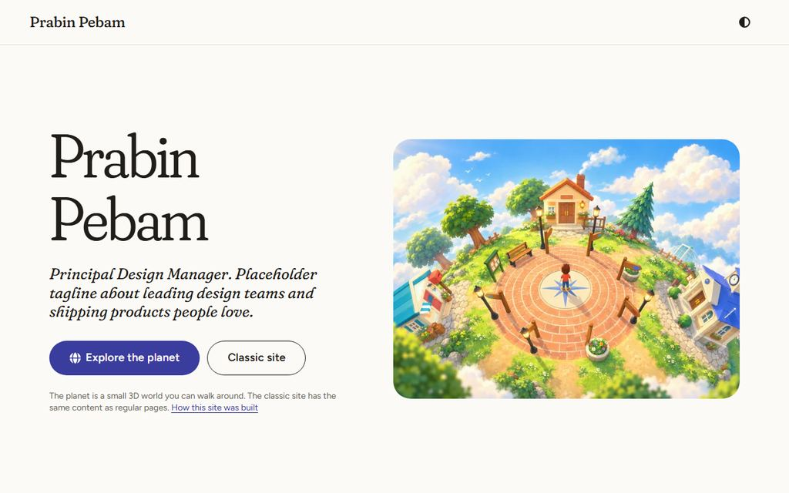
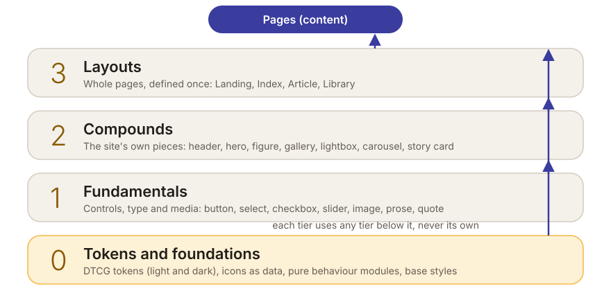
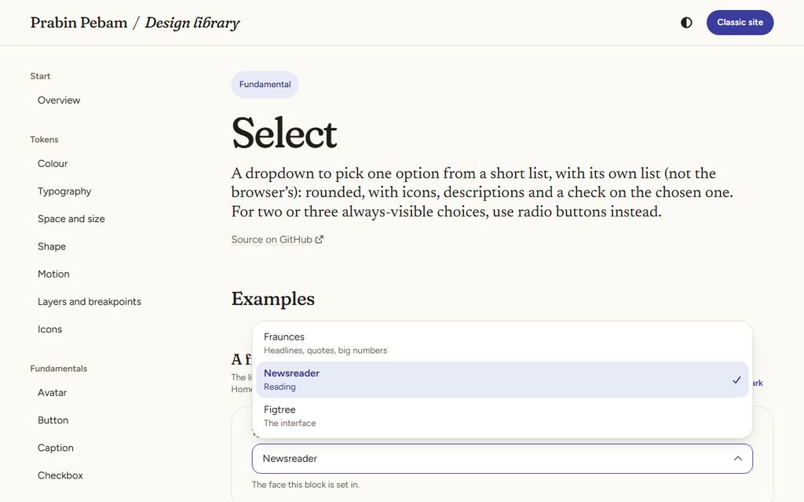

# Site design system: research, spec v1, critique, v2

This is the working spec and plan for the website's own design system: the landing, the classic site and the design library. The game keeps its separate system ([game UI design system](../game-ui/design-system.md)). The living rules as built are in [the site design system](design-system.md), the visual language in [visual language](visual-language.md), the token reference in [tokens](tokens.md) and the checklist in [the Definition of Done](dod.md).

> **TL;DR.** The website shared the game's token file and had 150 lines of page CSS, no dark mode and no components. V2 gives it its own system in four tiers: **tokens → fundamentals → compounds → layouts**, where each tier is built only from the ones below it and a test fails the build otherwise. The tokens are **W3C DTCG 2025.10**: a base set plus light and dark contexts, joined by a resolver. The look is **a clean printed magazine**: natural-white paper, warm ink, one indigo spot colour, a marigold highlighter, and three typefaces with one job each (Fraunces, Newsreader, Figtree). There are **40 components** (24 fundamentals, 16 compounds) and 4 layouts, including a fully custom dropdown, a lightbox with a smoke scrim and a filmstrip, and a carousel. The **design library** at `/design/` renders them live from the real code, with no Storybook: examples, source, props, keys, tokens used, and "uses" and "used by" are all read from the components themselves.

## 1. Research

The sources are cited inline. They were checked on 29 September 2026. Anything marked *opinion* is a synthesis.

### 1.1 Component catalogues ("Storybook, but lighter")

| Tool | Fit for static Astro components | Status |
|---|---|---|
| [Storybook](https://github.com/storybook-astro/storybook-astro) | Community framework only (`@storybook-astro/framework`, Astro 5.5 to 7), a separate app and build, and stories in its own format | Storybook 10.6 (2 Sep 2026) |
| [Ladle](https://ladle.dev/docs/) | React only | 5.1.1 (Nov 2025) |
| [Histoire](https://github.com/histoire-dev/histoire) | Vue and Svelte | 1.0 beta (Jan 2026) |
| [Pattern Lab](https://github.com/pattern-lab/patternlab-node) | Atomic design's own tool | Archived: no releases or security patches |
| [Fractal](https://github.com/frctl/fractal) | Clearleft's component library tool | Archived |
| [Astrobook](https://github.com/ocavue/astrobook) | Astro-native: scans `.stories.*`, mounts inside a site | 0.13.3, pre-1.0 |

**Documenting a system inside the site, from its real components, is a recognised pattern.**
- The [GOV.UK Design System](https://design-system.service.gov.uk/components/button/) renders live examples with code, from the same package that services use.
- [Every Layout](https://every-layout.dev/layouts/stack/) embeds the real custom elements in its pages.
- [Starlight](https://starlight.astro.build/components/cards/) previews its real components.

[Atomic Design](https://atomicdesign.bradfrost.com/chapter-2/) (atoms, molecules, organisms, templates, pages) is the model behind the owner's tiers. Brad Frost calls it "a mental model", not a linear process.

### 1.2 Tokens and themes

The W3C Design Tokens Community Group's format reached its **first stable version, 2025.10**, on [28 October 2025](https://www.w3.org/community/design-tokens/2025/10/28/design-tokens-specification-reaches-first-stable-version/).
- **Values:** [the format module](https://www.designtokens.org/tr/2025.10/format/) writes colours as `{colorSpace, components, hex}` and dimensions as `{value, unit}`. `$extensions` is for vendor data only.
- **Themes:** these belong in [the resolver module](https://www.designtokens.org/tr/2025.10/resolver/), not in `$extensions`. A resolver lists sets and modifiers (for example a theme with `light` and `dark` contexts), and its `resolutionOrder` merges them.

[`light-dark()`](https://web.dev/articles/light-dark) has been Baseline since May 2024 (Chrome 123, Firefox 120, Safari 17.5). It follows the element's `color-scheme`, so an unregistered custom property holding `light-dark()` resolves wherever it's used. This is what lets one subtree switch mode by itself.

### 1.3 Controls and patterns

- **Customisable select:** the native version (`appearance: base-select`) is in Chrome 135 and Safari 27, but Firefox has it only behind flags ([MDN data](https://github.com/mdn/browser-compat-data/blob/main/css/properties/appearance.json)). A dropdown whose list is our own therefore has to be built.
- **Keyboard patterns:** the WAI-ARIA Authoring Practices define the [select-only combobox](https://www.w3.org/WAI/ARIA/apg/patterns/combobox/examples/combobox-select-only/) keyboard model, which we copy key for key. They also cover the [carousel](https://www.w3.org/WAI/ARIA/apg/patterns/carousel/) (rotation needs a stop control and must pause on focus and hover; [WCAG 2.2.2](https://www.w3.org/WAI/WCAG22/Understanding/pause-stop-hide.html) applies), the [modal dialog](https://www.w3.org/WAI/ARIA/apg/patterns/dialog-modal/), the [slider](https://www.w3.org/WAI/ARIA/apg/patterns/slider/), the [switch](https://www.w3.org/WAI/ARIA/apg/patterns/switch/), the checkbox and the radio group.
- **Fluid type:** [Utopia](https://utopia.fyi/blog/designing-with-fluid-type-scales/) interpolates a small-screen scale into a large-screen one with `clamp()`. Viewport units can defeat zoom ([Roselli](https://adrianroselli.com/2019/12/responsive-type-and-zoom.html)). The maximum must be at most 2.5 times the minimum for 200% zoom to still work ([Barvian, Smashing](https://www.smashingmagazine.com/2023/11/addressing-accessibility-concerns-fluid-type/); [WCAG 1.4.4](https://www.w3.org/WAI/WCAG22/Understanding/resize-text.html)).
- **Video embeds:** Paul Irish's [lite-youtube-embed](https://github.com/paulirish/lite-youtube-embed) shows a facade until the click, and [youtube-nocookie.com](https://support.google.com/youtube/answer/171780) is YouTube's privacy-enhanced mode.
- **Article layout:** the breakout grid with named lines (content, popout, wide, full) comes from [Josh Comeau](https://www.joshwcomeau.com/css/full-bleed/) and [Ryan Mulligan](https://ryanmulligan.dev/blog/layout-breakouts/).

### 1.4 Fonts

The owner approved Google Fonts. Two findings argue for self-hosting them:
- **Privacy:** the [LG München ruling of 20 January 2022](https://gdprhub.eu/index.php?title=LG_M%C3%BCnchen_-_3_O_17493/20) (3 O 17493/20) found that embedding Google Fonts from Google's servers without consent sends the visitor's IP address to Google, in breach of the GDPR.
- **Performance:** browsers now [partition their HTTP cache](https://developer.chrome.com/blog/http-cache-partitioning) by site (Chrome 86, Safari, and [Firefox 85](https://blog.mozilla.org/security/2021/01/26/supercookie-protections/)), so a shared CDN no longer saves a download.

[Fontsource](https://fontsource.org/docs/getting-started/introduction) packages the same fonts for self-hosting. All seven candidates are in Google Fonts under the SIL OFL. The chosen three are described in [the visual language](visual-language.md) §3.

### 1.5 Design direction

Anthropic's [frontend-design skill](https://github.com/anthropics/skills/blob/main/skills/frontend-design/SKILL.md) names the traits generated designs cluster around. The critique in §3 applies it to v1:
- a warm cream background with a high-contrast serif and a terracotta accent;
- tracked uppercase eyebrows;
- metadata joined by middle dots;
- decorative numbered markers;
- one radius on everything.

## 2. Audit: the website as it was

- **One token file for two products.** The landing and the classic pages used the game's `src/design/tokens.json`, through its `paper` surface. There was no way to change the website without touching the game.
- **Page CSS, no components.** `src/styles/site.css` (156 lines) styled `.landing-*` and `.classic-*` classes directly.
- **No dark mode** (`color-scheme: light` was set on every page).
- **No controls beyond a button.**
- **No catalogue.** The rules lived in the game's design system document, §4.5, in four lines.
- **Nothing for a magazine:** no media components (figure, gallery, lightbox, video, carousel, quotes) and no article layout. Classic articles were a heading, a lede and Markdown.

## 3. Spec and plan v1 (first draft), and its critique

### 3.1 v1

- **Visual language:**
  - a cream page (#F4F1EA) with a terracotta accent;
  - Fraunces headlines, Newsreader text, Inter for the interface;
  - tracked uppercase kickers over every heading;
  - "01 / 02" section numbers;
  - hairline rules;
  - metadata as "Case study · 6 min · 2026";
  - a 12 px radius on everything.
- **Tokens:** a new `site` surface inside the game's `tokens.json`, with each dark value in `$extensions` and string values ("#F4F1EA", "1rem").
- **Tiers:** "each level made from the previous level", read literally: a compound only from fundamentals, a layout only from compounds, an icon as a fundamental.
- **Components:**
  - native `<select>`, checkbox and range, restyled where the browser allows;
  - a lightbox as a `
` overlay with a hand-written focus trap;
  - a carousel with autoplay and a pause button;
  - YouTube as a plain iframe;
  - Google Fonts from the CDN.
- **Catalogue:** a `/design/` route listing components from a hand-written `catalog.ts`, with each example's code pasted beside it as a string.
- **DoD:** components exist, the pages use them, dark mode works, and there's a catalogue page.

### 3.2 Critique

| # | Problem in v1 | Why it matters | V2 |
|---|---|---|---|
| 1 | Cream, terracotta and a high-contrast serif | It's the most common generated look (§1.5), and cream makes pictures look yellow. This brief is about pictures | Natural white (#FBFAF7) that pictures sit on cleanly; an indigo spot for action; marigold only as a highlighter |
| 2 | Uppercase kickers, middle dots, "01 / 02" | These are template chrome: they decorate rather than inform | Sentence-case labels only where they tell the reader something. Numbers only where the order means something (the classic site's contents page) |
| 3 | One 12 px radius everywhere | Flat, and it reads as a card kit | Radius by hierarchy: controls round, pictures softly rounded, full bleed square (§4 of the visual language) |
| 4 | The site's tokens inside the game's file | The owner wants two independent systems; a change to one would risk the other | A separate DTCG source under `src/site/design/` with its own build and test. The game's file isn't touched |
| 5 | Dark values in `$extensions`, string values | Not DTCG 2025.10: `$extensions` is vendor data, themes belong to the resolver, and values are objects | A base set, light and dark contexts, and `site.resolver.json` (2025.10); colour and dimension objects; `$extensions` only for vendor data (a fluid size's minimum, a number's CSS unit) |
| 6 | Tiers read as "only the previous level" | A layout couldn't use a heading or a button directly, and the icon, as a fundamental, couldn't be drawn by other fundamentals | "Made only from lower tiers" (any tier below, never its own). Icons and behaviour are tier 0, as data and pure modules. The test enforces the imports |
| 7 | No rule that stops a compound restyling a fundamental | The tiers would be decorative: a compound could reach inside a button | Fundamentals are sealed (no `class` or `style` props, a test). Compounds lay out fundamentals from their own wrappers, and `:global` is banned except where a component styles markup it didn't write |
| 8 | Native select, restyled | The dropdown's list can't be styled in Firefox (§1.3), and the owner asked for a custom list | A custom select-only combobox following the APG key for key, with its keyboard model pure and unit-tested |
| 9 | A `
` lightbox with a hand-written focus trap | Fragile: the focus leaks, the page behind stays reachable, and Escape has to be handled by hand | A native `<dialog>` with `showModal()`: focus trap, inert page and Escape for free. Focus returns to the picture that opened it |
| 10 | An autoplaying carousel | Needs a stop control, pausing on focus and hover, and more (APG, WCAG 2.2.2), and it distracts from reading | No rotation. Its ends are real (no wrap), and a counter and the dots show where you are |
| 11 | A plain YouTube iframe and the Google Fonts CDN | Third-party requests before any consent (§1.4), and weight | A video facade that loads nothing until clicked (youtube-nocookie, Vimeo `dnt=1`); fonts self-hosted through Fontsource, the same Google Fonts |
| 12 | Code pasted beside each example, and a hand-kept catalogue | They drift: the code shown isn't the code that ran, and a new component can be forgotten | The registry reads the components themselves: the doc comment, `interface Props` (through the TypeScript compiler), the tokens used, the imports. The example code is cut from the story that renders it. A test fails a component without a story |
| 13 | Dark mode as a class swap | Every component would need a dark branch, and a preview can't show both | `light-dark()` pairs: the page follows the system or `<html data-theme>`, and any subtree flips with `color-scheme` (the library's per-example Light/Dark switch, the always-dark lightbox) |
| 14 | A DoD without evidence | "Works" can't be checked | A numbered DoD, each row with a test or a file as evidence ([dod.md](dod.md)) |
| 15 | Inter for the interface | Neutral to the point of anonymity, and the default choice | Figtree: friendly and round at button sizes, clear at 14 px |

## 4. Spec v2 (as built)

### 4.1 Architecture

| Tier | Where | Made of | Count |
|---|---|---|---|
| 0: tokens and foundations | `src/site/design/` (tokens, icons, meta, samples, typography), `src/site/scripts/` (pure behaviour), `src/site/styles/` (generated tokens and fonts, base), `src/site/assets/` (the font cuts) | Nothing but data | 241 tokens |
| 1: fundamentals | `src/site/components/fundamentals/` | Tier 0 only | 24 |
| 2: compounds | `src/site/components/compounds/` | Fundamentals and tier 0 | 16 |
| 3: layouts | `src/site/layouts/` | Compounds, fundamentals and tier 0 | 4 |
| Pages | `src/pages/index.astro`, `src/pages/classic/`, `src/pages/design/` | Layouts, with content inside them; no styles | |

The game and the site import nothing from each other. The one shared helper is the base path (`withBase`, re-exported by `src/site/design/meta.ts`).

### 4.2 Tokens

- **Source:** `site.resolver.json` (DTCG 2025.10). It merges the base set `tokens.json` (primitives, type, space, shape, motion, layers, component tokens) with the theme modifier's context, `tokens.light.json` or `tokens.dark.json` (the colour roles).
- **Build:** `node scripts/build-site-tokens.mjs` resolves both contexts and writes `src/site/styles/tokens.css`:
  - a colour role that differs between the contexts becomes `light-dark(light, dark)`;
  - a fluid size becomes a `clamp()` between 360 px and 1280 px;
  - aliases stay as `var()` references.
- **Reference:** the same build writes [tokens.md](tokens.md).
- **The model:** pure (`tokenModel.ts`), shared by the build, the library and the tests.
- **The mode:** `<html data-theme>` sets it, or the system does by default. PageShell's inline head script applies the saved choice before the first paint.

### 4.3 The components

See [the design system](design-system.md) §5 for the catalogue. What sets them apart:
- **Select:** our own list (icons, a second line, a check), following the APG select-only combobox key for key, with a hidden input and `change` for forms.
- **Checkbox, radio, switch, slider:** native inputs with `appearance: none`, so the semantics, the keyboard and form submission stay the browser's.
- **Lightbox:**
  - one per page, a native `<dialog>`;
  - a smoky scrim of drifting blurred wisps (static under reduced motion);
  - a filmstrip of thumbnails, arrow keys, Home and End, swipe;
  - focus returns to the opener;
  - any `a[data-lightbox]` joins a group, so galleries, figures and carousels don't import it.
- **Carousel:** scroll-snap, no rotation, real ends, dots and a counter.
- **Video embed:** a local file with captions, or a YouTube or Vimeo facade that requests nothing until pressed.
- **Prose:** Markdown set as a magazine sets it, with the breakout grid, a drop cap (`initial-letter` where supported), old-style figures and a marigold dinkus.

### 4.4 The design library

`/design/` is built from the registry (`src/site/library/registry.ts`), so a new component gets its page from its file and its story alone:

- **Token pages** show each token as what it is: swatch strips and a role table in both modes with contrast ratios; the three faces as specimens, a live playground for Fraunces' axes, and the ramp at real size; spacing bars; radius tiles; shadows in both modes; easing curves and durations you can play; the layers; and the icon set.
- **Component pages** show:
  - live examples, each with a Light or Dark preview switch and the source cut from the story;
  - the props table (from `interface Props`);
  - the accessibility notes and keyboard table (from the doc comment);
  - the tokens it reads, each linked to its row;
  - "Uses" and "Used by" (from the imports).
- **Layout pages** frame the real page in a viewport switcher (phone, tablet, desktop) with its source.

### 4.5 Plan (as executed)

1. Research, v1, critique, v2 (this page).
2. Tokens: DTCG 2025.10 files, resolver, model, build, reference.
3. Foundations: base styles, icons as data, pure behaviour (select, theme, media), fonts.
4. Fundamentals, then compounds, then layouts, each with a story.
5. The library: registry, example frame, props table, token pages, viewport frame.
6. Moving the landing and the classic site onto the layouts, and removing `site.css` from the game's styles.
7. Enforcement: `siteDesignSystem.test.ts` and `siteBehaviour.test.ts` (unit), and the "site design system" group in `site.spec.ts` (E2E).
8. Documentation, screenshots and the Definition of Done ([dod.md](dod.md)).

## 5. Deferred, with reasons

- **A native `base-select` path:** our listbox is the one implementation until Firefox ships the feature. Then the list could be the browser's own, styled.
- **Pan and zoom inside the lightbox:** pinch-zoom works natively on phones; a desktop zoom waits for real case-study images that need it.
- **A table of contents for long reads:** there are no long reads yet. The layout has room for it in the popout column.
- **Code highlighting in the library:** plain, token-coloured code keeps the library's print look. Shiki's dual themes are the upgrade path if wanted.
- **Case-study content:** the classic pages still carry the placeholder landmark copy. The IA's work, expertise and leadership pages will use the Index and Article layouts as they are written.
