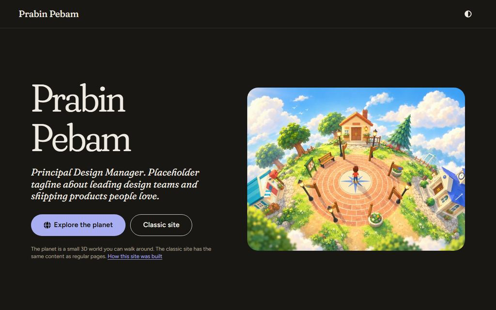
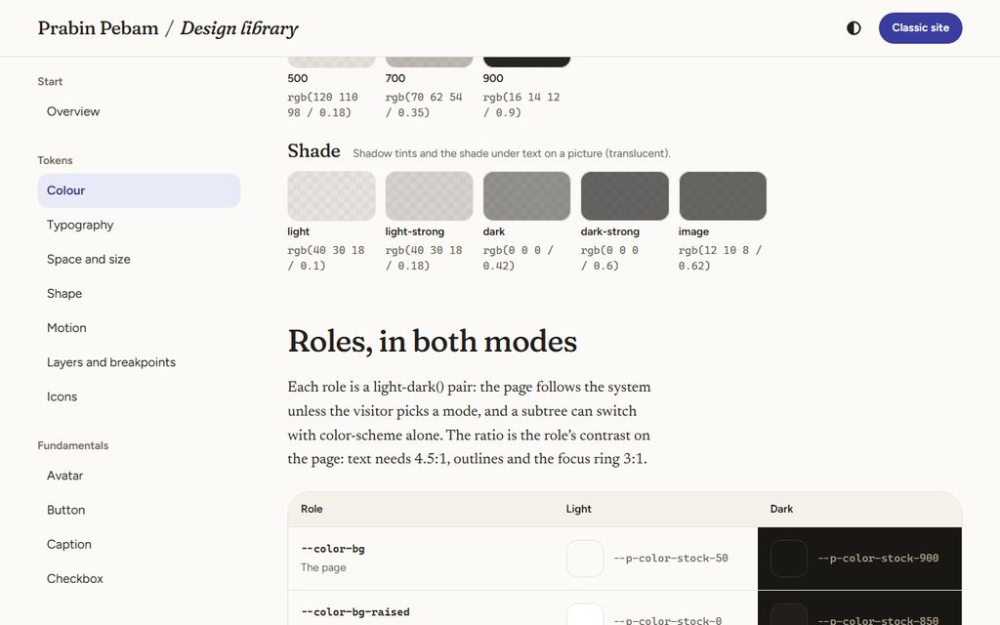
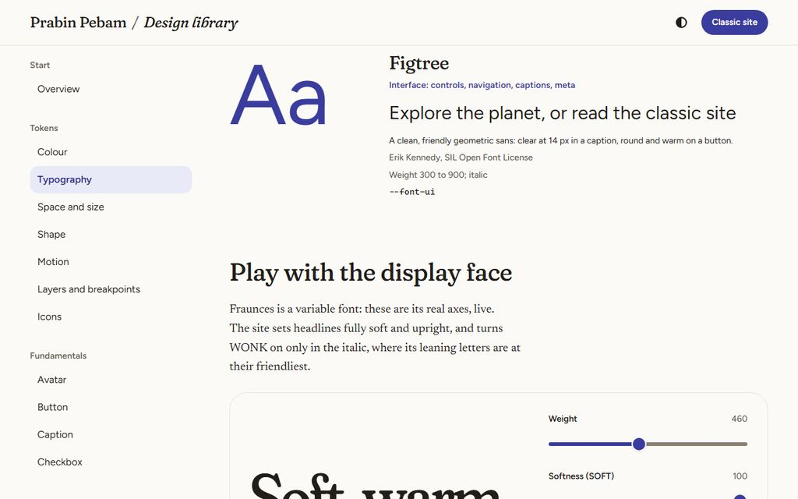
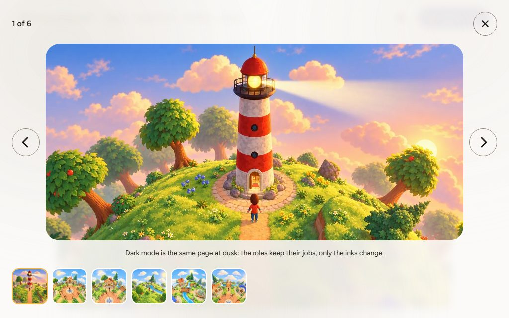

# Site visual language: a clean printed magazine

The look of the website's pages (the landing, the classic site, the design library), as proposed and as built. The rules that keep it are in [the site design system](design-system.md); every value here is a token ([tokens](tokens.md)), shown live in the design library at `/design/tokens/`.

> **TL;DR.** The site is set like a clean independent magazine. It has a lot of natural-white paper, warm press-black ink, one **indigo** spot colour for everything you can act on, and a **marigold** highlighter for the marks a printer would add. Pictures carry the pages, so they get room. Type is where the play is:
> - **Fraunces**, soft and warm, speaks (headlines, standfirsts, pull quotes, drop caps);
> - **Newsreader** reads;
> - **Figtree** works the interface.
>
> The interface is rounded and friendly, and dark mode is the same page at dusk.



## 1. The idea

**What the site is:** the portfolio of a Principal Design Manager. It has a playful 3D planet on one side and quiet pages on the other.

**What the pages must do:** read well, show pictures well, and never compete with the planet. So they borrow from print, where the paper, the column, the margins and the type have always done the work that decoration does on screens.

**Where the boldness goes:** one place, the display type. Everything else stays disciplined.

**What it deliberately isn't** (the critique in [the spec](spec.md) §3.2):
- the cream and terracotta page;
- tracked uppercase eyebrows over every heading;
- middle-dotted metadata;
- one radius on everything.

## 2. Colour: paper, ink, one spot, one highlighter

| Name | Light | Dark | Job |
|---|---|---|---|
| Natural white (paper) | `#FBFAF7` | `#191714` charcoal | The page. Close to white so pictures stay true; the warmth is in the ink |
| Press black (ink) | `#211E1A` | `#EFEAE2` chalk | Text and headlines (15.9:1 and 14.9:1) |
| Muted ink | `#655D53` | `#ADA496` | Captions, meta, hints (6.2:1 and 7.3:1) |
| Indigo (the spot) | `#3A3C9E` | `#A9AEF2` | Everything you can act on: links, primary buttons, checked controls, the selected option (8.7:1 and 8.5:1) |
| Marigold (the highlighter) | `#F4B942` | `#F4B942` | The quote rule and quote mark, list bullets, the dinkus, the filmstrip's current frame, the progress highlight. Never text on paper |
| Deep marigold | `#8A5A00` | `#F7CB6B` | Marigold as type, for the big numerals (5.7:1) |
| Leaf and poppy | `#2D6E45` and `#B0312A` | `#86CFA0` and `#F3A59C` | Success and errors, always with a word and an icon |
| Smoke | paper-white mist `rgb(251 250 247 / 0.92)`, warm-grey wisps at 0.35 and 0.3 | warm black `rgb(16 14 12 / 0.9)`, wisps at 0.35 and 0.18 | The lightbox's scrim: pictures on smoke, not on a flat fill; white on light, black on dark |

- **Warmth:** the neutrals are a warm stock ramp (14 steps from `#FFFFFF` to `#12100E`), and shadows are tinted brown (`rgb(40 30 18 / 0.1)`), never grey.
- **Contrast:** every role is tested in both modes ([the design system](design-system.md) §7).



## 3. Type: three faces, three jobs

| Face | Job | Why this one |
|---|---|---|
| **Fraunces** (Undercase Type; variable: opsz 9 to 144, wght, SOFT, WONK; roman and italic) | Display: headlines, standfirsts, pull quotes, drop caps, big numerals | A warm display serif in the line of 1970s magazine faces. Its **SOFT** axis rounds every serif, which gives the friendly, rounded feel the brief asks for without a rounded sans. The site sets it fully soft; **WONK** (the leaning letters) only in the italic, where it's most charming; optical size follows the size automatically |
| **Newsreader** (Production Type; variable wght; roman and italic) | Text: everything you read at length | Drawn for reading news and long reads on screens: sturdy, open, with an italic that holds up in a quotation. Set with old-style figures, as a book is |
| **Figtree** (Erik Kennedy; variable wght) | Interface: buttons, fields, navigation, captions, meta | A clean geometric sans that's round and warm on a button and clear at 14 px in a caption |

- **Licence and hosting:** all three are Google Fonts under the SIL OFL (none has a Reserved Font Name). They're served from the site, cut to what it uses, with no request to Google ([the spec](spec.md) §1.4).
- **Weight:** a page loads 159 to 241 KB of fonts. Fraunces is served with SOFT and WONK built in (60 KB roman, 77 KB italic, down from 118 and 146 KB), Newsreader cut to its regular to semibold weights (38 KB), and Figtree as it is (19 KB), with the italics fetched only where they're used. Each layout preloads the faces its first screen needs ([the mobile audit](mobile-audit.md) §3.1).

### 3.1 The ramp

Interface sizes are fixed. Reading and display sizes are fluid: each grows smoothly from a 360 px window to a 1280 px one, and none more than 2.5 times, so 200% zoom still enlarges text.

| Token | Size | Face and setting | Use |
|---|---|---|---|
| `--text-jumbo` | 56 to 136 px | Fraunces light, tight | Section numerals, a number that is the point |
| `--text-display` | 46 to 100 px | Fraunces light, tight | The landing's name, an index's title |
| `--text-h1` | 38 to 68 px | Fraunces 460, snug | An article's title |
| `--text-quote` | 26 to 44 px | Fraunces italic, WONK on | Pull quotes |
| `--text-h2` | 28 to 40 px | Fraunces 460 | Chapter headings |
| `--text-h3` | 23 to 30 px | Fraunces 460 | Section headings, card titles |
| `--text-lead` | 20 to 25 px | Fraunces italic (standfirst) or Newsreader (lead) | The line under a title; an opening paragraph |
| `--text-h4` | 20 to 24 px | Fraunces 460 | Small headings, the masthead's name |
| `--text-body` | 17 to 19 px | Newsreader, 1.62 leading, about 68 characters to the line | Running text |
| `--text-lg` | 18 px | Figtree | Large controls |
| `--text-md` | 16 px | Figtree | Controls, navigation |
| `--text-sm` | 14 px | Figtree | Captions, meta, small controls: the floor for anything you need to read |

**Where the play is:**
- the display face set large and light, with the tracking closed up;
- a drop cap three lines deep in indigo;
- pull quotes in the wonky italic behind a marigold quote mark;
- the classic site's contents page with its big deep-marigold numerals;
- and the library's live axes playground, which shows what the face can do.



## 4. Space, grid and shape

- **Whitespace is a token:**
  - `--space-section` (64 to 128 px) between a page's sections;
  - `--space-block` (36 to 56 px) around a figure or a quote;
  - `--space-gutter` (20 to 48 px) at the page's sides.

  Inside components, a 4 px scale.
- **The article grid** has named lines ([Comeau](https://www.joshwcomeau.com/css/full-bleed/), [Mulligan](https://ryanmulligan.dev/blog/layout-breakouts/)):

```text
|  full                                                                     |
|     |  wide (76 rem)                                               |      |
|     |        |  popout (52 rem)                           |        |      |
|     |        |      |  content (40 rem: the text column)  |       |      |
```

- **Placing things on the grid:** text sits in the content column; a figure, a gallery, a quote or a video steps out by declaring `popout`, `wide` or `full`. The article's header starts where the column starts and may run wider to the right, as a magazine opener does.
- **Radius by hierarchy:** rounded and friendly, but never one radius for everything:

| Thing | Radius |
|---|---|
| Buttons, tags, switches, progress bars, icon buttons, avatars | Pill or round |
| Text fields, the select's trigger, options | 14 px |
| Pictures in the text, cards, the dropdown list | 20 px |
| Feature pictures, the library's canvases | 28 px |
| A full-bleed picture | Square |

- **Shadows:** print has none, so they're rare. Only what floats casts one: the dropdown list, dialogs, the overlay buttons on a picture.

## 5. Pictures

- **Sized and placed:** every picture has a width and height (no layout shift), a responsive `srcset` and a paper-coloured placeholder, and it loads lazily unless it's the lead.
- **Given room:** captions are Figtree 14 px in muted ink with the credit after them, and a gallery has one caption for the set, as a magazine does.
- **A carousel's peek is a hint, never a cut:** its neighbouring slides show a little smaller (88%), under a fade that belongs to the carousel, not the slides: whole up to the neighbours' near edges, then to nothing across a slide's width beyond them. It stays put while the slides move under it, so the slide being shown never fades and the ones further out never flash into view. Where the page has room beside the carousel the fade reaches out into it, up to the page's main region. Where it has less, it ends at the edge, so nothing is cut off. A phone shows one slide at a time. Choosing a neighbour brings it to the middle.
- **The lightbox follows the theme:** a smoky scrim, paper-white in light mode and black in dark, with slow drifting wisps, its controls and caption in the page's own ink, the picture as large as fits, the caption under it, and a filmstrip of the set along the bottom with the current frame ringed in marigold.



## 6. Motion

Motion answers what you do; nothing moves on its own.
- **Standard easing** (`0.2, 0, 0, 1`) for most movement.
- **Spring** (`0.34, 1.56, 0.64, 1`) for small friendly moments: a check popping in, a switch's thumb, the dropdown opening.
- **Durations:** 90 ms (colour), 160 ms (small controls), 240 ms (the list), 420 ms (the lightbox's cross-fade, the carousel), 700 ms (the one page-load moment: the opening's words rise into place and its picture settles; text never fades, so its contrast never dips).
- **Reduced motion:** turns all of it off; the smoke stays still.

## 7. Icons and voice

- **Scrollbars:** no gutter and no arrow buttons: a slim handle of frosted glass, tinted with the spot indigo, floats over the edge while you scroll and fades away at rest, so a column keeps its whole measure.
- **Icons:** Font Awesome Pro Duotone, drawn inline from data and printed in two colours: the drawing in the text colour (ink, the indigo of a link, white on a primary button) over a second layer in the spot indigo: indigo-400 on paper (3.2:1, clearly there without outweighing the ink) and indigo-300 in dark mode, like a two-ink print. (Marigold, the first pairing, was too faint on paper at 1.7:1.) A status is tonal, both layers in its own colour, so a second colour never blurs what a colour means. So is an icon on an accent fill (a primary button), where indigo would sink into the fill. The little planet is the site's own drawing in the same two layers. They're never an emoji or a text symbol, and never a button's only name: an icon button's label is its accessible name and its tooltip.
- **Voice:**
  - sentence case;
  - buttons are verbs of three words or fewer ("Explore the planet", "Show the code");
  - field labels are nouns ("Email address");
  - errors say what happened and how to fix it;
  - curly quotes and apostrophes, as a typesetter would set them.
